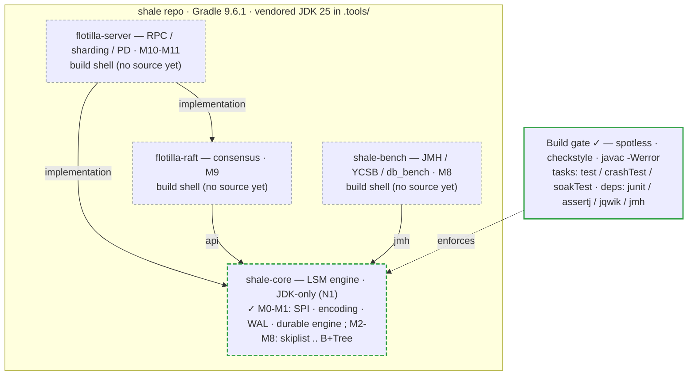
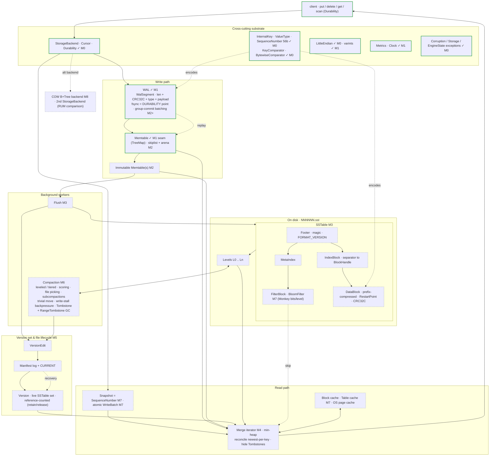
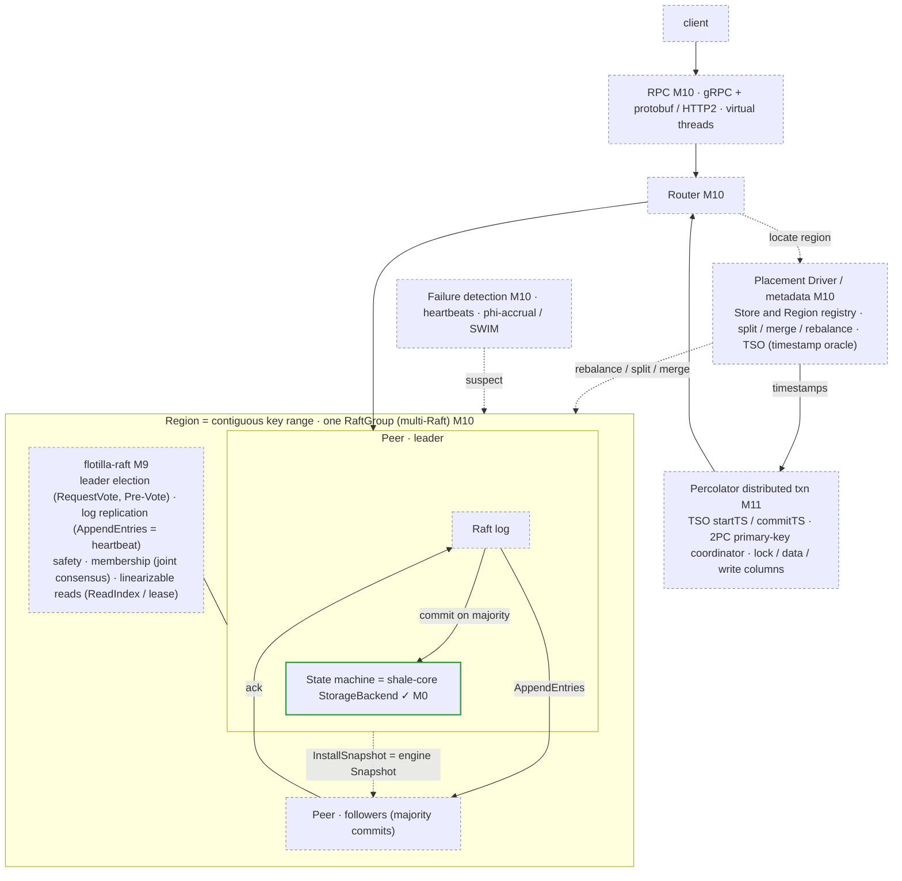
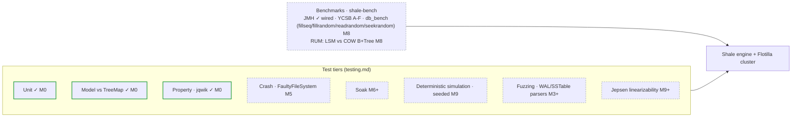

# Shale &nbsp;·&nbsp; Flotilla

A hand-written **LSM-tree storage engine** (`Shale`) and the **Raft-replicated,
range-sharded distributed store** built on top of it (`Flotilla`) — implemented from
first principles in Java, with no third-party library for any core mechanism.

> **The prime directive: the implementation *is* the product.**
> This is a study-and-portfolio project. Its value is that write-ahead logging,
> skiplists, SSTable encoding, compaction, bloom filters, MVCC, and consensus are each
> built by hand and understood in depth — not assembled from libraries. A dependency
> that implements a core concept is disallowed by rule, even when it would be faster
> and more correct. See [`CLAUDE.md`](CLAUDE.md) §4.

**Status:** **M1 complete** (tag `m1-wal`). The engine is **durable**: a LevelDB
block-structured WAL logs every mutation before an in-memory map, and reopening replays it —
proven by a crash test that truncates the log at every byte offset and always recovers a
clean prefix. `./gradlew build` + `crashTest` are green on JDK 25 (61 tests + crash suite).
M0 shipped the SPI, comparator, and internal-key encoding; M2+ of the roadmap is not yet
written. Built strictly bottom-up — durability and crash-recovery correctness before any
optimisation.

---

## Why this project

An LSM engine is unusually dense with deep-systems concepts that rarely appear in
typical application code: append-only durability, crash recovery and replay, immutable
file lifecycle with reference counting, background compaction with write-stall
backpressure, probabilistic membership (bloom filters), MVCC via sequence numbers, and
heap-based multi-way merge iteration — and then, on top, leader election, log
replication, snapshotting, range sharding, and distributed transactions.

The intellectual spine is the **RUM conjecture** (Athanassoulis et al., EDBT 2016): an
access method can bound at most two of *read*, *update*, and *memory* overhead, forcing
the third. Owning the engine means owning those knobs — compaction policy, bloom
bits-per-key, block size, memtable size — and being able to *measure* the tradeoff
rather than assert it.

## Architecture

```
flotilla-server ──▶ flotilla-raft ──▶ shale-core
       └───────────────────────────────────┘
```

`shale-core` is an embeddable single-node engine that **depends on nothing but the
JDK**. It must never depend on any networking, RPC, or clustering code — that boundary
is the architectural point of the project.

| Module | Role |
|---|---|
| `shale-core` | The LSM engine. WAL, memtable, SSTable, compaction, filters, MVCC, manifest. |
| `shale-bench` | JMH microbenchmarks + YCSB / db_bench-style macro harnesses. |
| `flotilla-raft` | Consensus from scratch: election, log replication, snapshotting. |
| `flotilla-server` | RPC, range sharding, split/merge, routing, placement/metadata. |

## Architecture — the complete project scope

The whole system, built and planned, in one place. Every box is a component from the
project's own inventory (`documentation/roadmap/shale-roadmap.md`) — nothing is invented.

**Legend:** solid box / `✓` = in the code now (M0). Dashed box + `Mn` = defined in the
[Roadmap](#roadmap) and built at milestone *Mn*. Today only `shale-core`'s M0 slice is
written; `shale-bench`, `flotilla-raft`, and `flotilla-server` are empty build shells.

### 1 · Modules, dependency direction, and the build gate



`shale-core` depends on nothing but the JDK; the other three depend inward only — the arrows
are enforced in each module's `build.gradle.kts`, not by convention. Only the M0 slice of
`shale-core` exists today (dashed border); everything else is a shell awaiting its milestone.

### 2 · Shale — the single-node engine (full component scope)

Write path, on-disk format, background work, version/recovery, and read path — every
component from the engine inventory. Only the cross-cutting substrate (SPI, key encoding,
comparators, coding, exceptions) is built; the rest is milestone-tagged.



### 3 · Flotilla — the distributed store (full component scope)

The engine becomes the replicated state machine behind Raft; a router and placement driver
shard the key space into Regions, each its own Raft group; Percolator adds distributed
transactions. All planned (M9–M11); the state machine is the M0 engine.



### 4 · Verification & benchmarking (full scope)



### 5 · As-built detail (per milestone)

The finer-grained diagrams of what actually exists in the code — the `shale-core` type graph,
the model harness, and each milestone's internals — live in
[`documentation/architecture/`](documentation/architecture/), organised by milestone so they
grow with the code instead of crowding this overview.

## Roadmap

Strictly ordered; each milestone ends in a runnable, tested artifact.

| | Milestone | Yields |
|---|---|---|
| **M0** | Skeleton & interfaces | `get/put/delete`, `StorageBackend`, comparator, internal-key encoding, `TreeMap` reference-model harness |
| **M1** | WAL + in-memory map | Append-only log (CRC + segments), recovery by replay, `sync` toggle — durability |
| **M2** | MemTable + immutable handoff | Hand-written skiplist, memory accounting, memtable switching |
| **M3** | SSTable write + flush | Data blocks, restart points, block index, footer |
| **M4** | Multi-SSTable reads | Heap-based multi-way merge, reconciliation, tombstones |
| **M5** | Manifest + recovery hardening | Version edits, atomic install, CURRENT, ref-counted lifecycle, crash tests |
| **M6** | Compaction | Size-tiered then leveled; scoring, file picking, background threads, write stalls |
| **M7** | Filters, cache, MVCC | Per-SSTable bloom, block/table cache, sequence-number snapshots, atomic batches |
| **M8** | COW B+Tree capstone | Copy-on-write B+Tree backend + full benchmark suite — the RUM tradeoff, measured |
| **M9** | Single Raft group | Engine as replicated state machine (snapshot = engine snapshot) |
| **M10** | Multi-Raft sharding | Range partitions, split/merge/rebalance, PD-like metadata + TSO, routing |
| **M11** | Distributed transactions | Percolator 2PC with primary-key coordinator and TSO timestamps |

Full charter, component inventory, citations, and effort estimates:
[`documentation/roadmap/shale-roadmap.md`](documentation/roadmap/shale-roadmap.md).

## Engineering non-negotiables

Enforced by `CLAUDE.md` §4 and the [conventions](documentation/conventions/):

- **N1** No third-party implementation of a core concept (allowlist gated by ADR).
- **N2** Never silently change an on-disk format — version bump, golden-file round-trip, `Format-Change:` trailer.
- **N3** Every write path states where durability happens (`// DURABILITY:`).
- **N4** Corruption is never repaired silently — throw with file, offset, expected/actual.
- **N5** Every mutable field declares its concurrency contract.
- **N9/N10** Every core type cites its source; vocabulary matches the LSM literature exactly.

## Building

Target JDK **25 (LTS)**; off-heap work uses the Foreign Function & Memory API
(`Arena`, `MemorySegment`).

```bash
./gradlew build     # compile + checkstyle + unit tests
./gradlew test      # unit tests only
./gradlew crashTest # fault-injection suite
./gradlew :shale-bench:jmh
```

## References

Alex Petrov, *Database Internals* (the project's spine); the LSM-Tree paper
(O'Neil et al., 1996); Raft (Ongaro & Ousterhout, 2014); Monkey (Dayan et al., 2017);
Percolator (Peng & Dabek, 2010); and skyzh's *mini-lsm*. Per-component citations live
alongside each type — see the roadmap's resource list.
