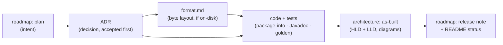

# Documentation map

Everything written about Shale and Flotilla lives here. This page is the door: it says what each kind
of document is for and the order to read them in. The standard these docs are held to — teach, don't
just record — is [`conventions/documentation.md`](conventions/documentation.md).

If you read nothing else, read the [top-level README](../README.md) for the mission and the
whole-system diagram, then come back here.

---

## Start here

1. **[README](../README.md)** — what the project is, why it exists, and the complete architecture at
   a glance (built vs. planned).
2. **[roadmap/shale-roadmap.md](roadmap/shale-roadmap.md)** — the charter: goals, non-goals, the RUM
   tradeoff at the heart of it, and the milestone build order (M0 → M11).
3. **A milestone, end to end** — pick one and read its three faces: the **decision** (`adr/`), the
   **as-built** explainer (`architecture/`), and, for on-disk work, the **byte layout**
   (`<package>/format.md`). M3 is a good example: [ADR-0010](adr/0010-sstable-block-table-format.md) →
   [m3-sstable-and-flush](architecture/m3-sstable-and-flush.md) →
   [format.md](../shale-core/src/main/java/dev/shale/sstable/format.md).

## The five kinds of document

| Area | What it answers | Index |
|---|---|---|
| **Roadmap** | *What are we building, and in what order?* Charter, per-milestone plans, release notes. | [roadmap/](roadmap/) |
| **ADRs** | *Why is it built this way?* One record per expensive, hard-to-reverse decision. | [adr/README.md](adr/README.md) |
| **Architecture** | *How does the shipped code actually work?* As-built HLD/LLD explainers with diagrams, per milestone. | [architecture/README.md](architecture/README.md) |
| **Conventions** | *What are the rules?* Naming, style, commits, concurrency, formats, errors, testing, docs. | [conventions/](conventions/) |
| **`format.md`** | *What exactly is on disk?* Byte tables + worked hex, beside the code, pinned by golden files. | e.g. [wal](../shale-core/src/main/java/dev/shale/wal/format.md), [sstable](../shale-core/src/main/java/dev/shale/sstable/format.md) |

## How a milestone's docs fit together

Each milestone flows through the same surfaces — intent, then decision, then (for on-disk work) the
byte layout, then the code, then the explainer and the note that it shipped:

## The rules (conventions)

| Topic | File |
|---|---|
| Naming, glossary, package layout | [naming.md](conventions/naming.md) |
| Java style, dependency allowlist | [java-style.md](conventions/java-style.md) |
| Commit messages, branches, trailers | [commits.md](conventions/commits.md) |
| Threading, resources, durability | [concurrency-and-resources.md](conventions/concurrency-and-resources.md) |
| Byte layouts, versioning, compatibility | [on-disk-formats.md](conventions/on-disk-formats.md) |
| Exceptions, logging, metrics | [errors-and-logging.md](conventions/errors-and-logging.md) |
| Test tiers, naming, determinism | [testing.md](conventions/testing.md) |
| Documentation, readability, diagrams | [documentation.md](conventions/documentation.md) |

## Where the project is now

Through **M3** (tag `m3-sstable`): a durable, crash-consistent engine with a write-ahead log, a
hand-written lock-free skiplist memtable, and flush to LevelDB-style SSTables. See the
[README status](../README.md) and the newest [release note](roadmap/) for specifics; the
[architecture index](architecture/README.md) lists the as-built HLD/LLD design of every completed
milestone.
