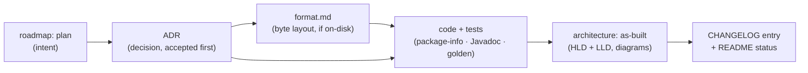

# Documentation map

Everything written about ShaleDB and its engine, Shale, lives here. This page is the door: it says what each kind
of document is for and the order to read them in. The standard these docs are held to — teach, don't
just record — is [`conventions/documentation.md`](conventions/documentation.md).

If you read nothing else, read the [top-level README](../README.md) for the mission and current
status, then come back here. **If you want to use the engine rather than study it**, go straight
to [Embedding Shale](guides/embedding-shale.md); for questions, the [FAQ](faq.md).

---

## Start here

1. **[README](../README.md)** — what the project is, and an honest built-vs-planned status table.
   The full scope diagrams are in [architecture/project-scope.md](architecture/project-scope.md).
2. **[roadmap/charter.md](roadmap/charter.md)** — why the project exists (a database whose every
   statement's cost is visible from SQL to disk), the design choices that follow, goals, non-goals,
   and the milestone order (engine M0 → M8, database D1 → D7).
3. **[roadmap/completion-plan.md](roadmap/completion-plan.md)** — the working plan: every remaining
   milestone in order, with its plan file, estimate, open decisions, cut lines and status. Start
   implementation here.
4. **A milestone, end to end** — pick one and read its three faces: the **decision** (`adr/`), the
   **as-built** explainer (`architecture/`), and, for on-disk work, the **byte layout**
   (`<package>/format.md`). M3 is a good example: [ADR-0010](adr/0010-sstable-block-table-format.md) →
   [m3-sstable-and-flush](architecture/m3-sstable-and-flush.md) →
   [format.md](../shale-core/src/main/java/dev/shale/sstable/format.md).

## The kinds of document

| Area | What it answers | Index |
|---|---|---|
| **Roadmap** | *Why, what, and in what order?* The charter, the completion plan, a plan per remaining milestone. | [charter](roadmap/charter.md) · [completion plan](roadmap/completion-plan.md) |
| **Guides** | *How do I use it?* Setup, API, durability, operation and limitations, for users rather than readers of the code. | [embedding Shale](guides/embedding-shale.md) · planned: operating Shale (M8), the ShaleDB quickstart (D5) and SQL reference (D2) |
| **FAQ** | *What would a user or an interviewer ask?* Short answers that link to the detail. | [faq.md](faq.md) |
| **Bug log** | *What went wrong, and how was it caught?* | [bug-log.md](bug-log.md) |
| **Changelog** | *What has shipped?* One entry per finished milestone. | [CHANGELOG.md](../CHANGELOG.md) |
| **ADRs** | *Why is it built this way?* One record per expensive, hard-to-reverse decision. | [adr/README.md](adr/README.md) |
| **Architecture** | *How does the shipped code actually work?* As-built HLD/LLD explainers with diagrams, per milestone. | [architecture/README.md](architecture/README.md) |
| **Conventions** | *What are the rules?* Naming, style, commits, concurrency, formats, errors, testing, docs. | [conventions/](conventions/) |
| **`format.md`** | *What exactly is on disk?* Byte tables + worked hex, beside the code, pinned by golden files. | e.g. [wal](../shale-core/src/main/java/dev/shale/wal/format.md), [sstable](../shale-core/src/main/java/dev/shale/sstable/format.md) |

## How a milestone's docs fit together

Each milestone flows through the same surfaces — intent, then decision, then (for on-disk work) the
byte layout, then the code, then the explainer and the note that it shipped:

```mermaid
flowchart LR
  plan["roadmap: plan<br/>(intent)"] --> adr["ADR<br/>(decision, accepted first)"]
  adr --> fmt["format.md<br/>(byte layout, if on-disk)"]
  fmt --> code["code + tests<br/>(package-info · Javadoc · golden)"]
  adr --> code
  code --> arch["architecture: as-built<br/>(HLD + LLD, diagrams)"]
  arch --> note["CHANGELOG entry<br/>+ README status"]
```

## The rules (conventions)

| Topic | File |
|---|---|
| Naming, glossary, package layout | [naming.md](conventions/naming.md) |
| Java style, dependency allowlist | [java-style.md](conventions/java-style.md) |
| Commit messages, branches, trailers | [commits.md](conventions/commits.md) |
| Threading, resources, durability | [concurrency-and-resources.md](conventions/concurrency-and-resources.md) |
| Byte layouts, versioning, compatibility | [on-disk-formats.md](conventions/on-disk-formats.md) |
| Exceptions, logging, metrics | [errors-and-logging.md](conventions/errors-and-logging.md) |
| Test tiers, naming, determinism | [testing.md](conventions/testing.md) |
| Documentation, readability, diagrams | [documentation.md](conventions/documentation.md) |

## Where the project is now

Through **M4** (tag `m4-merge`): a durable, crash-consistent engine with a write-ahead log, a
hand-written lock-free skiplist memtable, flush to LevelDB-style SSTables, and streaming reads
through a heap-based multi-way merge with reconciliation. See the
[README status](../README.md) and the [changelog](../CHANGELOG.md) for specifics, and the
[completion plan](roadmap/completion-plan.md) for what comes next; the
[architecture index](architecture/README.md) lists the as-built HLD/LLD design of every completed
milestone.
