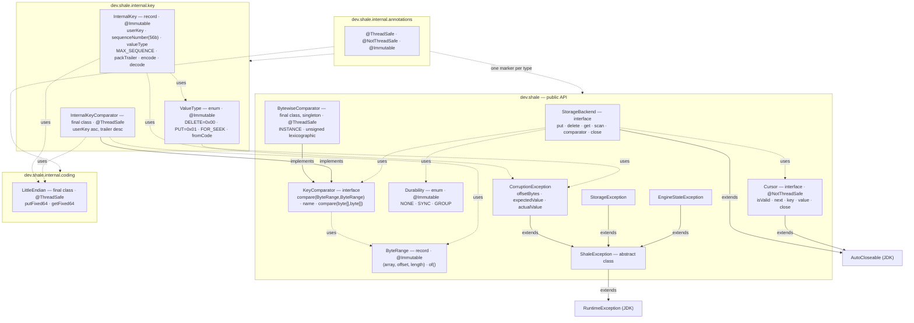
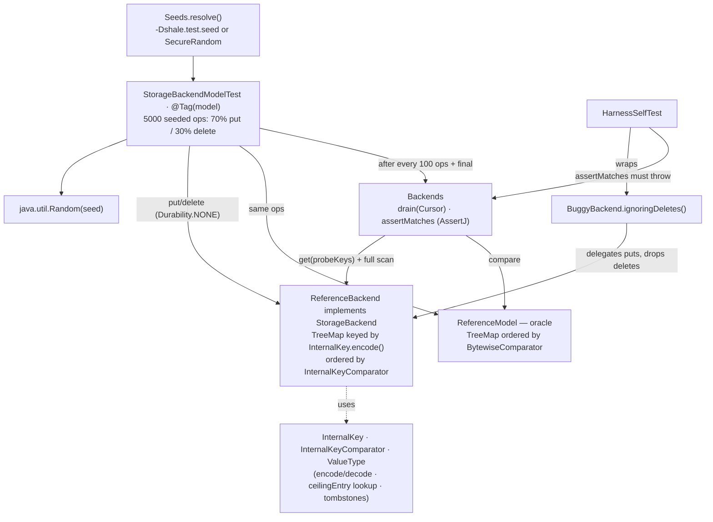

# M0 as-built — `shale-core` type graph and model harness

The detail behind the built (green) boxes in the
[README overview](../../README.md#architecture--the-complete-project-scope). Everything here
is in the code at tag `m0-skeleton`; see the [M0 release note](../roadmap/m0-release-note.md).

M0's one sentence: **the engine's contracts are locked and provable before any storage
mechanism exists** — the `StorageBackend` SPI, the internal-key encoding, little-endian
integers, and the exceptions that rule them, all checked by a `TreeMap`-oracle harness that
every later milestone reuses.

---

## 1. In the whole project — the contracts and the harness

M0 writes no storage and gives the engine its two permanent assets:

1. **The hard-to-reverse contracts** every later milestone implements: the `StorageBackend`
   SPI (ADR-0006), the internal-key encoding (ADR-0004), little-endian integers (ADR-0005),
   and the exception taxonomy — chosen *before* any mechanism existed, because re-deciding them
   once the WAL, SSTable, and compaction reference them is expensive.
2. **The differential model harness** — a `TreeMap` oracle riding the real M0 encoding. This is
   the durable asset: every later milestone is validated the same way, by driving the *real*
   engine against the same oracle and asserting zero divergence.

Where it sits: M1 mounts durability behind `StorageBackend` and reuses `InternalKey`/`ValueType`
unchanged; the same backend-vs-oracle harness carries on through flush (M3), compaction (M6),
and snapshots (M7); and Flotilla will front the same seam with a replicated log. The encoding
decided here is the byte language every on-disk format in `wal/` and `sstable/` speaks.

---

## 2. High-level design (HLD) — the contracts the engine is built on

`shale-core` at M0 is *all surface*: there is no storage yet, only the interfaces, the encoding,
and the rules every later mechanism is written against. Three package groups hold it:

- **`dev.shale` — the public API.** The `StorageBackend` SPI (byte-key/byte-value `get`/`put`/
  `delete`/`scan`), `Durability` (`NONE`/`SYNC`/`GROUP`), `Cursor`, `ByteRange`, `KeyComparator`
  (+ `BytewiseComparator`), and the `ShaleException` hierarchy. Every backend from M1 on —
  in-memory, flush-based, B+Tree, replicated — ships behind this surface.
- **`dev.shale.internal.key` — the single key type.** `InternalKey` (`userKey ‖ fixed64LE((seq <<
  8) | type)`), `ValueType`, and `InternalKeyComparator`, ordered user-key ascending then trailer
  descending so the newest version sorts first. This is the type the memtable, WAL, and SSTable
  all share verbatim (ADR-0004).
- **`dev.shale.internal.coding` + annotations.** The one byte-order decision (little-endian,
  ADR-0005), plus the `@ThreadSafe`/`@NotThreadSafe`/`@Immutable` markers every type must declare
  (N5).

The orchestration is proven before any mechanism exists: a reference backend built on the *real*
encoding is diffed against a `TreeMap` oracle under seeded random ops (70% put / 30% delete),
and a self-test proves the diff actually bites. The same harness is the acceptance gate for
every milestone after this one.

---

## 3. Low-level design (LLD) — the 17 types that hold the contract

Everything M0 ships, with real `implements` / `extends` / `uses` edges and the concurrency
annotation on each type. The byte-level decisions behind the labels — endianness, the 56/8 sequence/type split, the
reserved `ValueType` codes — are pinned by ADR-0004 and ADR-0005.

The harness is where these 17 types get exercised before the engine exists: `ReferenceBackend`
stores encoded `InternalKey`s in a `TreeMap` ordered by `InternalKeyComparator`, resolves a `get`
via a `FOR_SEEK`/`MAX_SEQUENCE` ceiling lookup, and hides tombstones on `scan` — turning the
sort-order contract (newest-first) into something executable.

---

## 4. What proves it

The executable flow behind the whole milestone — the real M0 encoding, diffed against a plain
`TreeMap` oracle:

`HarnessSelfTest` proves the assertion really bites: it runs a backend that ignores deletes, so
the diff must throw. A harness that can fail is what makes its passing meaningful.

| Behaviour | Test |
|---|---|
| Encode/decode round-trip; comparator total order | `InternalKeyTest` + `…PropertyTest`, `InternalKeyComparatorTest` |
| Byte order and masks | `LittleEndianPropertyTest` |
| `ValueType` codes and reserved range | `ValueTypeTest` |
| ByteRange/BytewiseComparator contracts | `ByteRangeTest`, `BytewiseComparatorTest` + `…PropertyTest` |
| Backend ≡ `TreeMap` oracle under seeded random ops (70/30), reproducible from `-Dshale.test.seed` | `StorageBackendModelTest` (`@Tag("model")`) |
| The harness fails when deletes are dropped — the diff really bites | `HarnessSelfTest` wrapping `BuggyBackend.ignoringDeletes()` |
