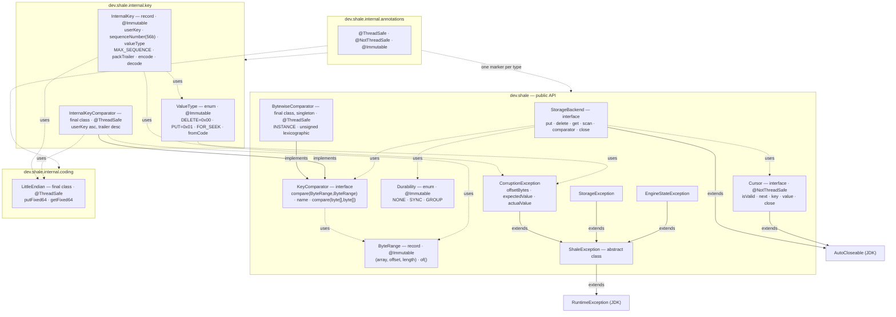
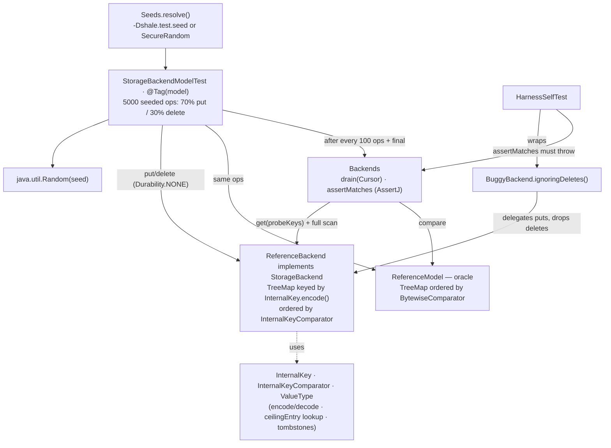

# M0 as-built — `shale-core` type graph and model harness

The detail behind the built (green) boxes in the
[README overview](../../README.md#architecture--the-complete-project-scope). Everything here
is in the code at tag `m0-skeleton`; see the [M0 release note](../roadmap/m0-release-note.md).

## The `shale-core` type graph (all 17 types)

Real `implements` / `extends` / `uses` edges and the concurrency annotation on each type.

Per-type coverage (29 cases): `ByteRangeTest`, `BytewiseComparatorTest` + `…PropertyTest`,
`CorruptionExceptionTest`, `LittleEndianPropertyTest`, `ValueTypeTest`, `InternalKeyTest` +
`…PropertyTest`, `InternalKeyComparatorTest`.

## The model harness (`dev.shale.model`)

The one executable flow at M0: a reference backend built on the real encoding, diffed against
a `TreeMap` oracle.

`ReferenceBackend` is the only thing that actually exercises the M0 encoding: it stores
encoded `InternalKey`s in a `TreeMap` ordered by `InternalKeyComparator`, resolves a `get`
via a `FOR_SEEK`/`MAX_SEQUENCE` ceiling lookup, and hides tombstones on `scan`. The oracle
is a plain `TreeMap`; the harness asserts they never diverge, and `HarnessSelfTest` proves
the assertion bites by running a backend that ignores deletes.
