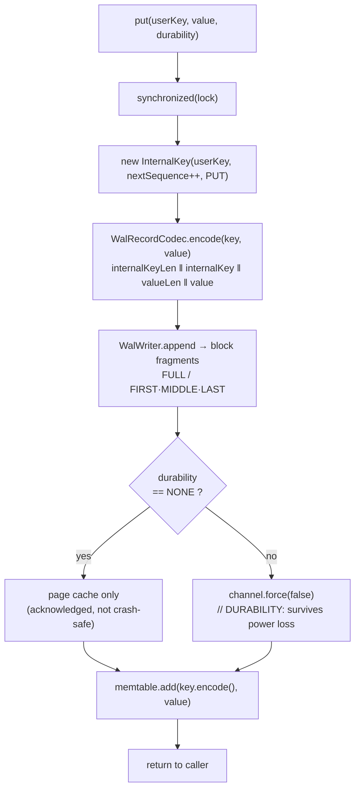
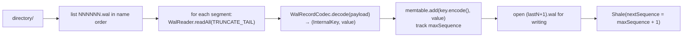
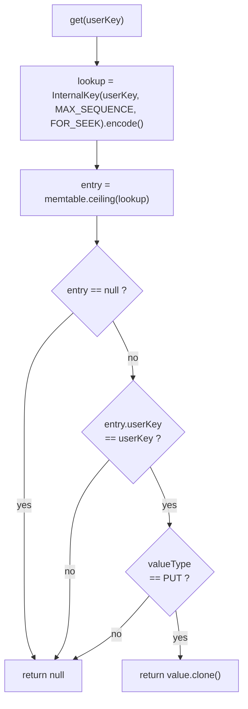
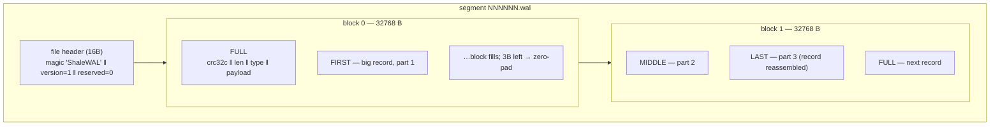
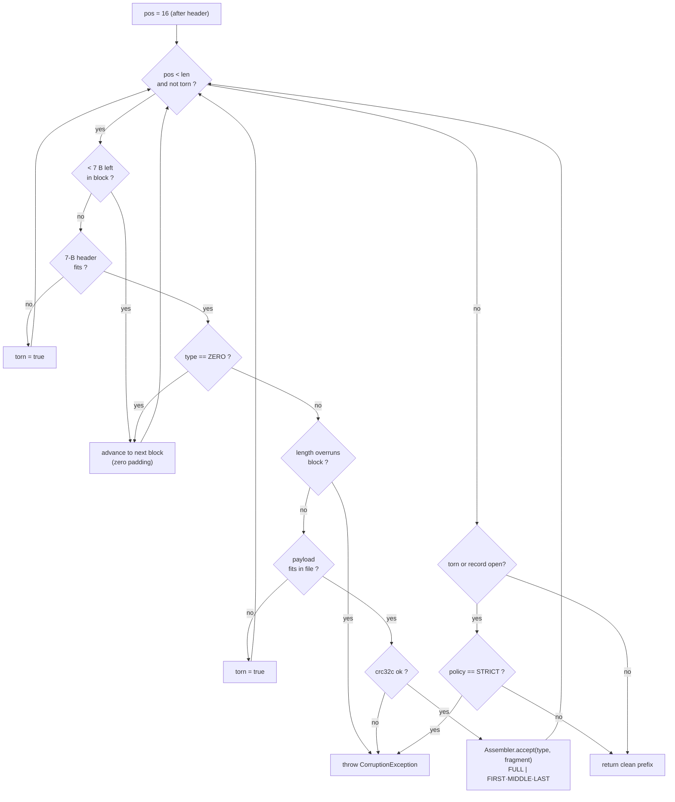
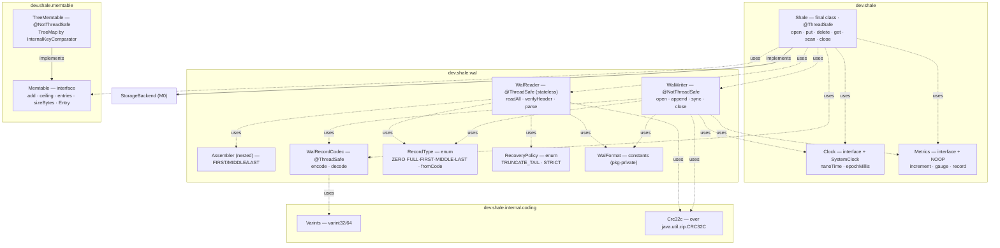

# M1 as-built — WAL, durability, and the in-memory map

The detail behind the built (green) boxes added at M1 in the
[README overview](../../README.md#architecture--the-complete-project-scope). Everything here is
in the code at tag `m1-wal`; see the [M1 release note](../roadmap/m1-release-note.md), the
decisions in [ADR-0007](../adr/0007-wal-block-log-format.md) (block-log format) and
[ADR-0008](../adr/0008-durability-and-clock.md) (durability + clock), and the byte-level spec in
[`wal/format.md`](../../shale-core/src/main/java/dev/shale/wal/format.md).

M1's one sentence: **every mutation is made durable in the write-ahead log before it is applied to
an in-memory map, and opening the engine replays that log to recover.** That is the whole of
durability and crash-consistency; SSTables, flush, and compaction arrive at M3+.

---

## 1. In the whole project — why this milestone matters

M1 turns the M0 contracts into a real, durable backend. It is the first `StorageBackend`
implementation, and the ordering it pins down — **WAL durable before the memtable is updated,
before acknowledgement** (D3) — is the single invariant every later milestone (flush, compaction,
MVCC) builds on. Its three deliverables recur throughout the project:

1. **The WAL** (`dev.shale.wal`, ADR-0007) — the log every write passes through and that recovery
   replays; M3's flush deletes a segment only after the SSTable covering it is durable.
2. **The `Durability` contract** (ADR-0008) — `NONE`/`SYNC`/`GROUP`, chosen per write; the engine's
   external knob from here through Flotilla's replicated writes.
3. **The memtable seam** (`Memtable`/`TreeMemtable`) — the interface M2's skiplist fills in without
   the engine changing; also the first place the engine reads "newest version wins".

The rest splits into the engine-level flows (HLD, §2) and the mechanism inside the classes and
bytes (LLD, §3); the crash test in §4 is what "durable" is held against.

---

## 2. High-level design (HLD) — what the engine does

How a request moves through the system, what contract each durability mode makes, and how the
engine comes back to life — as the whole engine sees them. The internal machinery these flows
depend on is the LLD in §3.

### 2.1 The write path — WAL-first, then memtable

A `put`/`delete` on [`Shale`](../../shale-core/src/main/java/dev/shale/Shale.java) serialises on one
monitor, stamps the next sequence number into an `InternalKey`, encodes the mutation, appends it to
the WAL, and only then updates the memtable. The durability guarantee is discharged **inside** the
WAL append, before the call returns.

The ordering is the invariant, marked in code with the `// D3: WAL durable before memtable` comment
in [`Shale.append`](../../shale-core/src/main/java/dev/shale/Shale.java): if the process dies between
the append and the `memtable.add`, recovery replays the logged record and the memtable is rebuilt —
no acknowledged write is lost. The reverse order could acknowledge a write that recovery cannot find.

A `delete` takes the identical path with `ValueType.DELETE` and an empty value; the tombstone is a
first-class logged record, not the absence of one.

#### Durability modes (ADR-0008)

| Mode    | `force()` before return? | Meaning                                                        |
|---------|--------------------------|----------------------------------------------------------------|
| `NONE`  | no                       | in the page cache; survives process crash, not power loss      |
| `SYNC`  | yes, every append        | fsync'd before ack; survives power loss                        |
| `GROUP` | yes (M1: same as SYNC)   | reserved for batched group-commit fsync — one fsync, many writers (M2+) |

The single line where data becomes durable is `channel.force(false)` in
[`WalWriter.sync`](../../shale-core/src/main/java/dev/shale/wal/WalWriter.java), and it is the only
place a `// DURABILITY:` marker appears in the WAL — satisfying CLAUDE.md N3 (every write path states
where durability happens). The fsync is timed through the injected `Clock` into `wal.sync.duration`,
never `System.nanoTime()` directly (N8, testability).

### 2.2 Opening and recovery

[`Shale.open`](../../shale-core/src/main/java/dev/shale/Shale.java) is the recovery path: list the
`NNNNNN.wal` segments in name order, replay each under `TRUNCATE_TAIL`, and fold every decoded
mutation into a fresh memtable while tracking the maximum sequence number seen. A new active segment
`(lastNumber + 1).wal` is then opened for subsequent writes, and `nextSequence` resumes at
`maxSequence + 1` so recovered and new keys keep a single monotonic order.

At M1 there is exactly one segment per run and no flush, so recovery replays the whole history; from
M3 the manifest will bound replay to segments newer than the last flush.

### 2.3 The read path — newest-first, merge-and-hide

The memtable stores **encoded internal keys** ordered by `InternalKeyComparator` (user key ascending,
trailer descending), so for any user key its newest version sorts first. A `get` therefore builds a
lookup key at `MAX_SEQUENCE` with the `FOR_SEEK` type and asks the memtable for the **ceiling** — the
smallest entry ≥ the lookup. If that entry shares the user key, it is the newest version; a `DELETE`
type resolves to `null`, a `PUT` returns a defensive clone of the value.

`scan` walks entries in ascending internal-key order, keeps only the **first** (newest) entry seen
per user key, drops tombstones, applies the `[fromInclusive, toExclusive)` bound, and materialises
the survivors into a `ListCursor`. This is the M1 stand-in for the heap-based multi-way merge that
arrives at M4 once reads must span the memtable and many SSTables.

---

## 3. Low-level design (LLD) — the mechanism, down to the byte

Where the HLD flows become concrete structures: the format that puts one record on disk in
fragments, the state machine that reads it back, and the type graph that connects them. The exact
byte layout with a worked hex example is pinned in
[`wal/format.md`](../../shale-core/src/main/java/dev/shale/wal/format.md).

### 3.1 WAL segment anatomy — how one record becomes bytes

A segment is a 16-byte file header followed by a stream of fixed **32 KiB blocks**. A logical record
(one mutation payload) is cut into **fragments** that never cross a block boundary; a record smaller
than the space left in the block is a single `FULL` fragment, a larger one becomes `FIRST` then zero
or more `MIDDLE` then `LAST`. When fewer than 7 bytes (a fragment header) remain in a block, the tail
is zero-padded and the next fragment starts the next block.

The 7-byte fragment header is `crc32c(4) ‖ length(2) ‖ type(1)`, and the CRC (CRC32C / Castagnoli,
unmasked) covers **the type byte and the payload** — see
[`WalWriter.writeFragment`](../../shale-core/src/main/java/dev/shale/wal/WalWriter.java) and the exact
byte layout with a worked example and the pinned golden CRC (`F3 27 F3 CC`) in
[`wal/format.md`](../../shale-core/src/main/java/dev/shale/wal/format.md). Block framing is the point:
a torn tail damages at most the last block, and the reader can reason about "record spans blocks"
locally rather than scanning the whole file.

### 3.2 The reader — recovery as a state machine

[`WalReader.readAll`](../../shale-core/src/main/java/dev/shale/wal/WalReader.java) walks the fragment
stream, verifies every CRC, and reassembles records. Its central job is to tell two things apart that
look superficially similar at the tail of a file:

- **A torn tail** — a fragment header or payload that runs off the end of the file, or a record left
  open (`FIRST` with no `LAST`). This is the *normal* result of a crash mid-append: the bytes were
  never fully written, so the write was never acknowledged. Under `TRUNCATE_TAIL` the reader stops
  and returns the clean prefix; under `STRICT` it throws.
- **Corruption** — a fragment that is fully present but wrong: a CRC mismatch, a length that overruns
  its block, an out-of-sequence fragment type, or a bad file header/magic. These are **never**
  silently skipped or repaired — `CorruptionException` carries the file offset and expected/actual
  values (CLAUDE.md N4). A present-but-wrong byte is a real fault; a missing byte is a torn tail.

Reassembly is the nested
[`Assembler`](../../shale-core/src/main/java/dev/shale/wal/WalReader.java): a `FULL` fragment is a
whole record; `FIRST` opens a pending buffer, `MIDDLE` appends, `LAST` closes it. A fragment type
arriving out of sequence (a `MIDDLE` with no open record, a `FIRST` while one is already open) is
corruption, not a torn tail — the file structure is internally inconsistent. This is exactly the
property the crash test exercises byte by byte (§4).

### 3.3 The types added at M1

Real `implements`/`uses` edges and the concurrency annotation on each new type. The M0 key stack
(`InternalKey`, `InternalKeyComparator`, `ValueType`, `LittleEndian`) and API (`StorageBackend`,
`Durability`, `Cursor`) are reused unchanged — see the [M0 as-built doc](m0-shale-core.md).

## 4. What proves it

| Behaviour | Test |
|---|---|
| Round-trip small records; record spanning many blocks; `SYNC` readable back | `wal/WalTest` |
| Torn tail → clean prefix (`TRUNCATE_TAIL`) vs. throws (`STRICT`) | `wal/WalTest` |
| Bit-flip in a present fragment is corruption, not a torn tail; bad magic is corruption | `wal/WalTest` |
| Record payload encode/decode; field overrun is corruption | `wal/WalRecordCodecTest` |
| Frozen byte layout matches the checked-in golden segment | `wal/GoldenWalTest` + `golden/wal/v1/single-put.wal` |
| Varints, CRC32C, injected clock, metrics sink | `VarintsTest`/`…PropertyTest`, `Crc32cTest`, `ClockTest`, `MetricsTest` |
| End-to-end put/get/delete/scan through the durable engine | `ShaleTest` |
| **Truncate the WAL at every offset ≥ 16 → engine reopens with a clean prefix, never a wrong or partial value** | `ShaleCrashTest` (`@Tag("crash")`) |

The crash test is the load-bearing one: it writes `k0…k4` under `SYNC`, truncates the segment at
every byte offset from the end of the header onward, and asserts each recovery is exactly some prefix
of the writes — no extra records, none reordered, no half-decoded value. That is the operational
meaning of "durable and crash-consistent" at M1.
