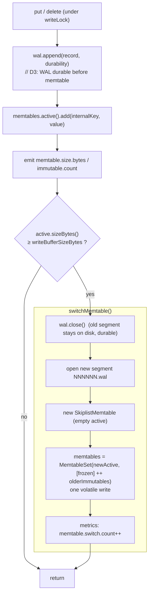
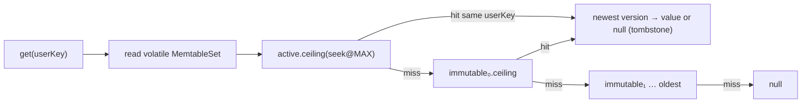
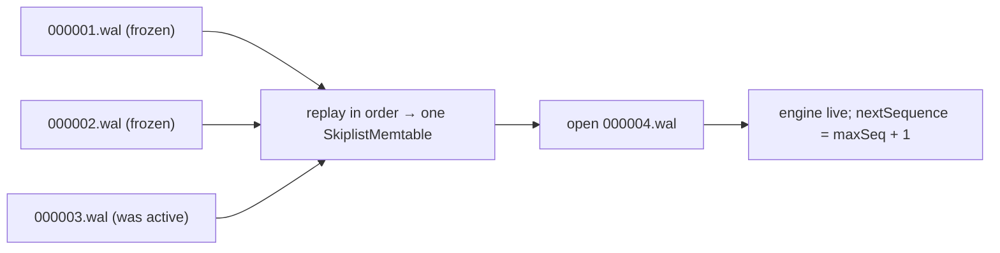
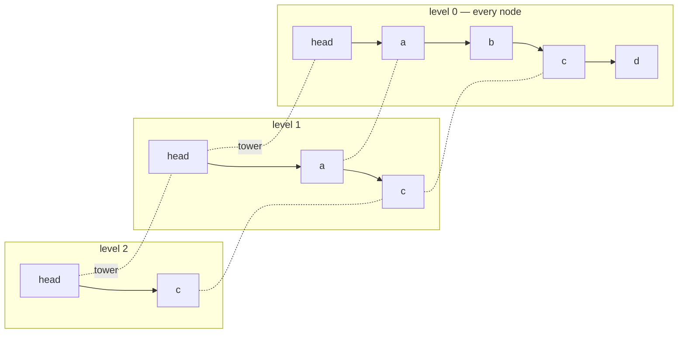
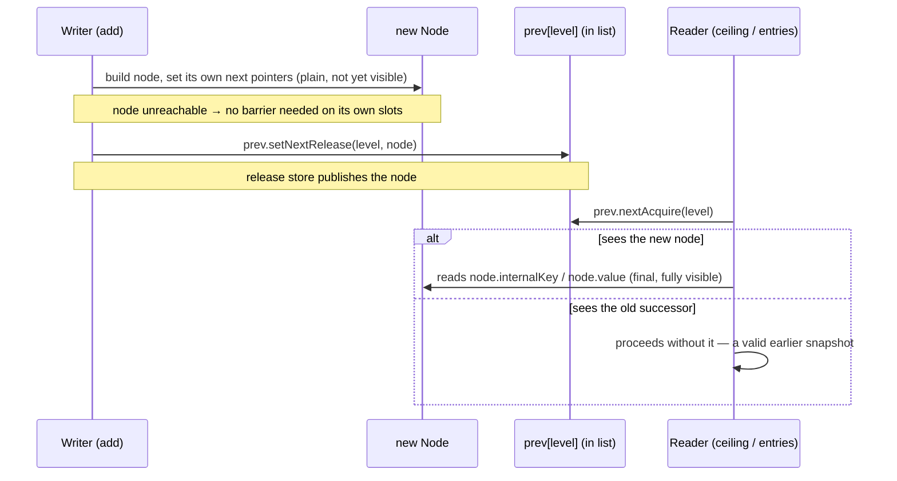
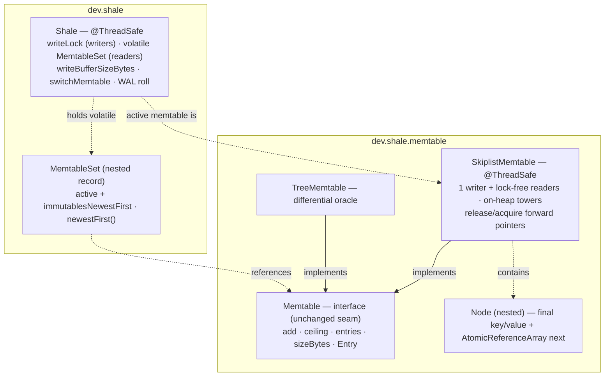

# M2 as-built — the skiplist memtable and the active → immutable handoff

The detail behind the boxes added at M2 in the
[README overview](../../README.md#architecture--the-complete-project-scope). Everything here is in
the code at tag `m2-skiplist`; see the [M2 release note](../roadmap/m2-release-note.md), the decision
in [ADR-0009](../adr/0009-skiplist-memtable.md), and the plan in
[m2-skiplist-memtable.md](../roadmap/m2-skiplist-memtable.md).

M2's one sentence: **the memtable becomes a hand-written lock-free skiplist, and when it fills the
engine freezes it and starts a new one — so reads no longer block writes.** Flushing those frozen
memtables to disk is M3; until then they accumulate in memory.

---

## 1. In the whole project — why this milestone matters

M2 keeps M1's durability and removes M1's biggest simplification: reads no longer block writes.
It delivers three things the roadmap names — a **hand-written skiplist** memtable, **memory
accounting**, and the **active → immutable handoff** (memtable switching) — so the mutable
memtable finally becomes the same shape real LSM engines have: one hot buffer that freezes into
a queue of immutable ones. All three recur later:

1. **The skiplist** (`dev.shale.memtable.SkiplistMemtable`, ADR-0009) — LevelDB's single-writer,
   lock-free-reader design, hand-written (N1). The memtable is exactly what M3 serialises to an
   SSTable, so this is the structure every later flush writes from.
2. **The handoff** (`MemtableSet` active + immutables) — the switch publishes one `volatile`
   snapshot so readers never contend. M3's flush *drains* those immutables to disk; until then
   they accumulate in memory (the documented M2 → M3 seam).
3. **The differential oracle** — `TreeMemtable` is kept and turned into the test oracle that
   checks the skiplist is observably a sorted map. The same oracle pattern (engine vs `TreeMap`)
   drives the whole-project model harness through every later milestone.

Where it sits: M2 replaces the M1 map beneath the unchanged `Memtable` seam and leaves the WAL
format (ADR-0007) untouched; a switch only rolls to a new segment using M1's machinery. The
concurrency contract it locks in — single writer, lock-free readers — becomes the engine's read
path behaviour from here on.

---

## 2. High-level design (HLD) — what the engine does

The engine-level view of M2: how a write is applied and when the active memtable freezes into
a immutable one, how reads answer without blocking, and how recovery re-forms one memtable out
of many segments. The internals — the skiplist and its safe-publication reasoning — are the LLD
in §3.

### 2.1 The write path and the memtable switch

Writers serialise on the engine's `writeLock`, which guards the WAL, the sequence counter, and
publication of the memtable set. The D3 ordering from M1 is unchanged — WAL durable **before** the
memtable is updated. What is new: after applying the write, if the active memtable has reached
`writeBufferSizeBytes` (default 4 MiB), the engine **switches**.

The switch publishes a new immutable `MemtableSet` with a **single volatile write**, so a concurrent
reader sees either the old set or the new one — never a half-updated structure, and never blocks. The
frozen memtable's data is already durable in its (now closed) WAL segment; that segment remains on
disk until the memtable is flushed to an SSTable and the segment deleted — **that drain is M3**. Until
then, immutable memtables accumulate in memory (the documented M2 → M3 seam); the default buffer size
keeps ordinary use well clear of it, and tests drive switching with a small buffer.

### 2.2 Reads across the memtable set

A read takes one volatile read of the `MemtableSet` and consults the memtables **newest first**
(active, then immutables newest→oldest). Because a switch happens at a sequence-number boundary, all
of the active memtable's sequences post-date every immutable's — so for a point read, the first
memtable holding *any* version of the key holds its *newest* version, and no cross-memtable
reconciliation is needed.

`scan` merges the whole set: it concatenates each memtable's ascending `entries()`, sorts by internal
key, keeps the first (newest) entry per user key, drops tombstones, and applies the range bound. This
in-memory merge is M2's stand-in for the heap-based multi-way merge across SSTables that arrives at
M4.

### 2.3 Recovery collapses the split

The runtime active/immutable split is a memory-only concept at M2 — nothing on disk records it. On
reopen, [`Shale.open`](../../shale-core/src/main/java/dev/shale/Shale.java) replays **every** present
segment in order into a single active memtable. Because sequence order is preserved across segments,
the merged logical state is identical to the pre-crash split; the split simply re-forms as new writes
cross the threshold again.

---

## 3. Low-level design (LLD) — the mechanism, down to the pointer

Where the HLD flows become concrete: the probabilistic list structure, the exact publication
rules that make readers safe without locks, and the types that implement them.

### 3.1 The skiplist: towers and express lanes

A skiplist is a sorted linked list with probabilistic "express lanes." Every node sits at level 0;
each node also rises to higher levels with probability 1/4 per level (LevelDB's branching factor),
capped at 12 levels. A search starts at the top of the head sentinel and drops down a level whenever
the next node would overshoot the target — so it skips over most of the list, giving expected
O(log n) search without the rebalancing a tree needs.

A search for `d`: start at `head` level 2 → `c` (c < d, advance) → at `c` level 2 the next is null, drop
to level 1 → next is null, drop to level 0 → `d`. Nodes carry the **encoded internal key** and value;
ordering is by [`InternalKeyComparator`](../../shale-core/src/main/java/dev/shale/internal/key/InternalKeyComparator.java)
(user key ascending, sequence descending), so the newest version of a key sorts first.

### 3.2 One writer, lock-free readers — safe publication

The concurrency contract (ADR-0009) is LevelDB's: **at most one writer at a time** (the engine
serialises inserts) and **any number of lock-free readers**. The only mutable shared state is each
node's forward-pointer array. `add` links a new node bottom-up, publishing each pointer with a
**release** store; readers follow pointers with an **acquire** load. The consequence: a reader that
observes a node also observes its fully-initialised (final) key and value — it may miss a concurrent
insert, but it never sees a torn or half-linked node.

`max height` is a `volatile int`: raising it publishes the new express lanes; a reader that reads a
stale smaller height still traverses correctly on the lower levels. This is verified two ways: a
[differential property test](../../shale-core/src/test/java/dev/shale/memtable/SkiplistMemtablePropertyTest.java)
asserts the skiplist returns identical `entries()`/`ceiling()` to a `TreeMap` oracle, and a
[concurrency stress test](../../shale-core/src/test/java/dev/shale/memtable/SkiplistMemtableConcurrencyTest.java)
runs four readers against a live writer asserting no torn or out-of-order entry is ever observed.

### 3.3 The types added / changed at M2

## 4. What proves it

| Behaviour | Test |
|---|---|
| Ordering, newest-version-first, tombstone entries, `ceiling` boundaries | `memtable/SkiplistMemtableTest` |
| Skiplist ≡ `TreeMap` oracle on `entries()`/`ceiling()` over random ops | `memtable/SkiplistMemtablePropertyTest` |
| Lock-free readers never see a torn or out-of-order node under a live writer | `memtable/SkiplistMemtableConcurrencyTest` |
| A full buffer triggers switches and rolls new WAL segments | `ShaleMemtableSwitchTest` |
| Values written across switches all read back; overwrite of a stranded key wins | `ShaleMemtableSwitchTest` |
| Reopen after switches recovers every acknowledged write | `ShaleMemtableSwitchTest` |
| M1 engine, crash, and model suites still green (behaviour preserved) | `ShaleTest`, `ShaleCrashTest`, `model/*` |
