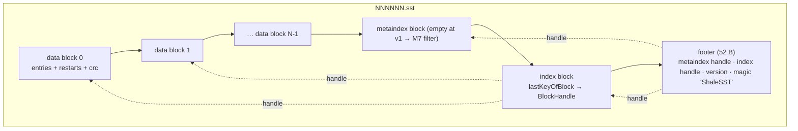
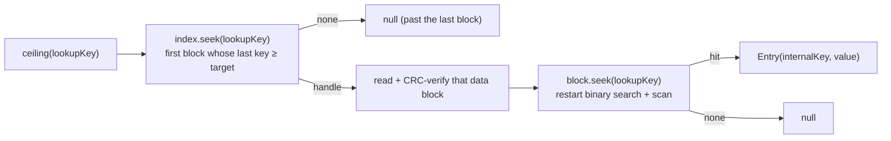
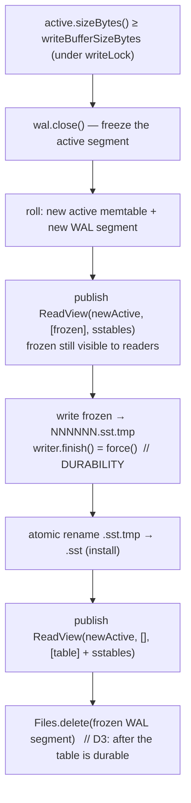
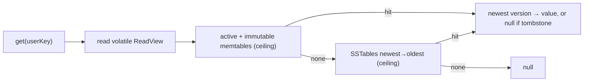
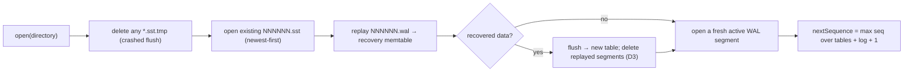
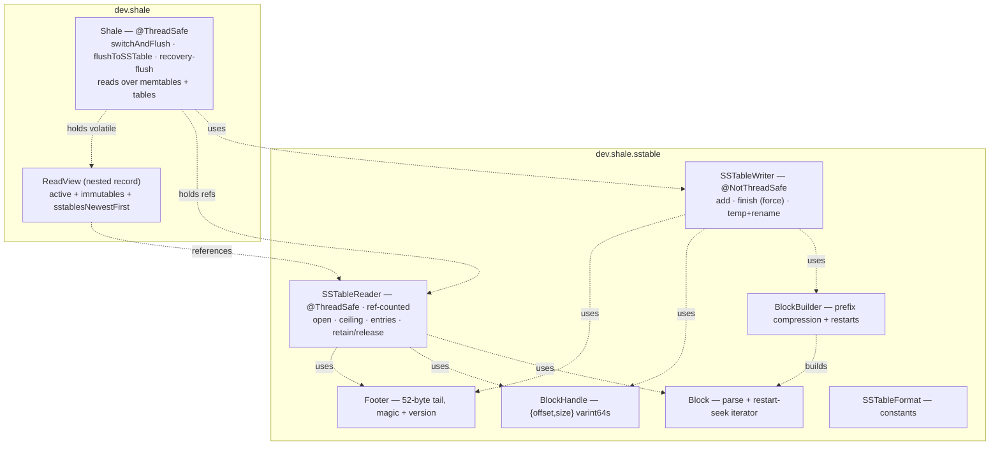

# M3 as-built — the SSTable format and flush

The detail behind the boxes added at M3 in the
[README overview](../../README.md#architecture--the-complete-project-scope). Everything here is in the
code at tag `m3-sstable`; see the [M3 release note](../roadmap/m3-release-note.md), the decision in
[ADR-0010](../adr/0010-sstable-block-table-format.md), and the byte-level spec in
[`sstable/format.md`](../../shale-core/src/main/java/dev/shale/sstable/format.md).

M3's one sentence: **when the memtable fills, it is written to an immutable on-disk SSTable and its
WAL segment is reclaimed — so the engine finally has durable, sorted tables, and reads span the
memtable set and those tables.** The multi-way merge iterator across many tables is M4; the manifest
that tracks them is M5.

---

## 1. The SSTable file — a LevelDB block table

A table is a sequence of prefix-compressed data blocks, an (empty, M7-ready) metaindex block, an
index block, and a fixed footer read from the end. Every block carries a `type ‖ crc32c` trailer;
a `BlockHandle{offset, size}` locates one block from another.

Inside a data block ([`BlockBuilder`](../../shale-core/src/main/java/dev/shale/sstable/BlockBuilder.java)),
each entry stores only the bytes of its key that differ from the previous key (`shared`/`non_shared`),
with a full key at every 16th entry — a **restart point**. A trailing array of restart offsets plus a
count lets [`Block`](../../shale-core/src/main/java/dev/shale/sstable/Block.java) binary-search the
restarts, then scan forward at most one interval. The keys are encoded internal keys (ADR-0004), so a
table holds MVCC versions and tombstones, ordered by `InternalKeyComparator`. The exact bytes — with a
worked example and the golden-pinned CRCs — are in `format.md`.

## 2. Reading a table: index → data block → restart search

[`SSTableReader.open`](../../shale-core/src/main/java/dev/shale/sstable/SSTableReader.java) verifies
the footer and loads the index; a point lookup then touches exactly one data block.

Every block read is CRC-checked before its bytes are trusted (N4); a bad footer magic, version,
padding, or a block whose length overruns the file is `CorruptionException` with the offset. The
reader is reference-counted over its `FileChannel` (`retain`/`release`, N6) and thread-safe via
positional reads.

## 3. Flush: memtable → SSTable, then reclaim the WAL segment

When a write pushes the active memtable past `writeBufferSizeBytes`, the engine freezes it, writes it
to a table, and drops its log. The order is the durability contract (D3): the table is fsync'd and
atomically installed **before** the WAL segment that also holds its data is deleted.

The flush is **synchronous** on the write path at M3 (it blocks that one writer; readers stay
lock-free throughout). A background flush thread with write stalls is M6. Publishing the frozen
memtable as an immutable before the flush, then replacing it with the table after, means a concurrent
reader always sees the data — as a memtable or as a table, never neither.

## 4. Reads across memtables and tables

A read takes one volatile read of the `ReadView` and consults sources newest-first: the active
memtable, any immutable memtables, then the SSTables (most-recently-flushed first). Because a flush
moves *older* data to a table while newer writes stay in memory, the first source holding any version
of a key holds its newest version — so a memtable tombstone shadows a flushed value with no extra
reconciliation.

`scan` merges every source's entries by internal key, keeps the first (newest) per user key, drops
tombstones, and applies the range — the M3 stand-in for M4's streaming heap merge.

## 5. Recovery: replay, flush, then reset the log

On open, [`Shale.open`](../../shale-core/src/main/java/dev/shale/Shale.java) loads the existing tables,
replays any WAL into a recovery memtable, flushes it to a fresh table, and deletes the replayed
segments — so a reopen ends with an empty log and all recovered data in tables. A `*.sst.tmp` left by
a flush that crashed before its rename is ignored and cleaned up, so a partial table never breaks
reopen (the job the manifest does properly at M5).

The next sequence number is derived from both the tables and the replayed log, so recovered and new
writes keep one monotonic order; file numbers come from one counter shared by `.wal` and `.sst`
(naming §7). Bounding replay to segments newer than the last flush — and tracking all of this in a
manifest rather than by directory scan — is M5.

## 6. The types added at M3

## 7. What proves it

| Behaviour | Test |
|---|---|
| Block prefix compression, restart cadence, empty block | `sstable/BlockBuilderTest` |
| Block reconstruct + restart-seek + structural corruption | `sstable/BlockTest` |
| BlockHandle round-trip | `sstable/BlockHandleTest` |
| Table round-trip: ceiling, ordered iteration, bad footer magic | `sstable/SSTableTest` |
| **Every single-byte flip is detected or provably harmless** | `sstable/SSTableTest` |
| Frozen golden `two-puts.sst` still decodes (format-drift guard) | `sstable/GoldenSSTableTest` |
| Write/read fidelity vs an ordered map over random inputs | `sstable/SSTablePropertyTest` |
| Flush writes tables and reclaims WAL segments; scan merges sources | `ShaleFlushTest` |
| Memtable tombstone shadows a flushed value; reopen recovers all | `ShaleFlushTest` |
| A crashed flush's `.sst.tmp` is ignored on open | `ShaleFlushTest` |
| Real engine vs oracle through flushes and restarts | `model/EngineModelTest` |
| WAL truncation at every offset still recovers a clean prefix | `ShaleCrashTest` |
