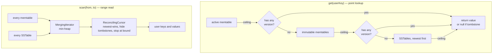
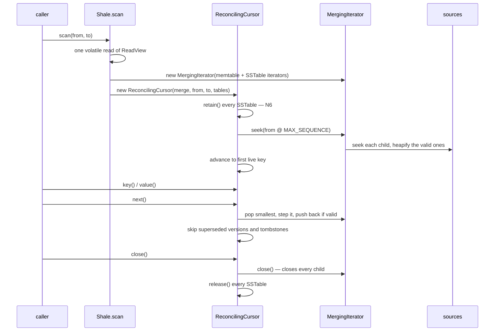

# M4 as-built — merge iteration and reconciliation

The detail behind the read path rebuilt at M4 in the
[README overview](../../README.md#architecture--the-complete-project-scope). Everything here is in the
code at tag `m4-merge`; see the [M4 release note](../roadmap/m4-release-note.md) and the decision in
[ADR-0011](../adr/0011-internal-iterator-seam.md).

M4's one sentence: **every read source now presents the same iterator, a heap merges them into one
ordered stream, and a cursor reconciles that stream into what a reader sees — so a scan costs its
result instead of the whole database.** Snapshot filtering is M7; the manifest that will delete the
tables this cursor pins is M5.

---

## 1. In the whole project — why this milestone matters

M3 left the engine correct but structurally provisional. Its `scan` decoded every entry from every
memtable and every SSTable into one list, sorted it, and threw away everything outside the requested
range — so a one-key scan of a million-key database paid for a million entries and peak memory was
the database. `SSTableReader.entries()` said so in its own Javadoc: *"the streaming merge across
tables is M4."*

What M4 hands to the rest of the project:

1. **One iterator seam** (`InternalIterator`) — a skiplist walk, a `TreeMap` walk, and a two-level
   descent through an SSTable's index and data blocks become indistinguishable to anything above
   them. Every later milestone that reads more than one source uses it.
2. **A merge that does not interpret** (`MergingIterator`) — a min-heap yielding global internal-key
   order and nothing else. M6's compaction needs exactly this merge with the *opposite* retention
   rule, so keeping the interpretation out is what makes it reusable.
3. **Reconciliation in one place** (`ReconcilingCursor`) — newest-wins, tombstones hide, bounds
   stop the scan. When M7 adds snapshot sequence filtering, it is a fourth rule in this one class.
4. **A cursor that owns what it reads** — the reference counting written at M3 and unexercised
   since finally has a consumer. From M5, when the manifest starts deleting tables, that pin is
   what stands between a long scan and a file removed underneath it.

Where it sits: M4 changes cost, not answers. The engine model harness drives the real engine against
a `TreeMap` oracle through constant flushes and restarts, and it passed unchanged — which is the
claim worth making about a read-path rewrite.

---

## 2. High-level design (HLD) — what the engine does

### 2.1 The two read paths, and why they stayed separate



A point lookup wants **the first source holding any version of one key**, not a globally ordered
stream. It needs no heap, no per-source seek, and no allocation beyond its result, so it keeps
probing `ceiling` newest-first. LevelDB splits `DBImpl::Get` from its iterator path for the same
reason. The two must agree about what is visible; both memtable and SSTable tests assert that
`seek` and `ceiling` resolve a target identically, because a divergence there would make `get` and
`scan` answer differently for the same key.

### 2.2 A scan, end to end



The lower bound is a **seek**, not a filter: each source jumps straight to it. That single change is
most of the milestone's value. Seeking at the maximal trailer lands before every version of the bound
key, which is what keeps an inclusive bound inclusive.

### 2.3 Reconciliation

Three rules, applied to the merged stream:

| Rule | Why it works |
|---|---|
| Newest version of a user key wins | Sequence descends within a user key (ADR-0004), so the merge yields the newest first; every later entry for that key is skipped |
| A tombstone hides the key | If the newest version is a delete, the key is absent — and rule 1 has already arranged to skip the older values behind it |
| The upper bound ends the scan | User keys ascend, so the first key at or past `toExclusive` means everything after it is too |

**Source order is never consulted.** Precedence lives entirely in the sequence number, so a newer
version wins even when it sits in an older source. That is what keeps the rule correct as the LSM
grows more places to look — and it is tested by deliberately putting the winning version in the
"wrong" source, because an implementation that took "first source holding the key" would pass every
other case and be wrong in production.

---

## 3. Low-level design (LLD) — the mechanism

### 3.1 The heap

`MergingIterator` holds a `PriorityQueue` with one slot per **non-exhausted** child, so advancing is
`O(log n)` in live sources rather than `O(n)`:

```
next():  pop the smallest child
         step it
         push it back only if it still has entries
```

Popping *before* stepping is required, not stylistic: a `PriorityQueue` may not have an element's
priority change while it is in the queue, and stepping a child is exactly that change. A child that
runs dry is simply not pushed back and the heap shrinks.

**Ties are unreachable.** Sequence numbers are unique per mutation, so two children can never present
the same internal key. The comparator still defines a tie-break by child index, because a comparator
returning 0 for distinct elements orders them arbitrarily, and "arbitrary but deterministic" is the
difference between a reproducible bug and a heisenbug. The tie-break carries no precedence meaning.

**On `java.util.PriorityQueue` and N1.** N1 requires the project's *subjects* to be hand-written and
lists them: skiplists, bloom filters, serialisation frameworks, compression codecs, Raft, caches,
B-trees. A priority queue is on none of them, and CLAUDE.md permits JDK structures that are not a
project subject. The subject here is merge-iteration — the seek-per-source, the pop-step-push cycle,
the reconciliation above it — and all of that is written out. ADR-0011 records this as a judgment
call about where N1's boundary falls; a hand-written binary heap would be contained entirely within
this class.

### 3.2 The two-level SSTable iterator

```
index block:  [ last key of block 0 → handle ] [ last key of block 1 → handle ] ...
                        │
                        ▼  opened only when iteration reaches it
data block:   [ restart ][ entry ][ entry ] ... [ restart ][ entry ] ...
```

The index records each data block's **last** key, so the first index entry whose key is ≥ a target
names the only block that can hold it. A seek is therefore one binary search in the index plus one
binary search inside a single data block, and iterating a 100 MB table costs one block of memory.

The subtle part is the **fall-through**. The index answering "the target is not after this block"
does *not* promise the block contains an entry ≥ the target — a target sorting after every key in the
chosen block must continue into the next one. Ordinary advance off the end of a block needs the same
step, so one loop serves both, and it loops rather than stepping once because a block could be empty.

### 3.3 Ownership

`ReferenceCounted` is a new interface rather than the cursor taking `SSTableReader` directly:
`dev.shale.sstable` already depends on `dev.shale.iterator` (its iterator implements the seam), so
the reverse would be a cycle. Naming the capability keeps the arrow pointing one way.

It carries **both** `retain` and `release`. A cursor handed only a way to release would depend on
some other code having remembered to retain, and that split is how use-after-free gets written. The
cursor retains in its constructor and releases in `close()`.

Consequence: **`Cursor.close()` is load-bearing.** An unclosed cursor pins file handles. At M4
nothing deletes a table so the cost is only handles; from M5 it is correctness.

The cursor also **copies** the key and value it returns. An `InternalIterator`'s arrays belong to it
and may not outlive the next advance, but `Cursor` hands bytes to a caller entitled to keep them — as
the materialising cursor it replaced did. One copy per *returned* entry is proportional to the
result, which is the cost model this milestone restores.

### 3.4 The types added at M4

| Type | Package | Role |
|---|---|---|
| `InternalIterator` | `dev.shale.iterator` | The seam: `seek`, `seekToFirst`, `valid`, `next`, `internalKey`, `value`, `close` |
| `MergingIterator` | `dev.shale.iterator` | Min-heap over children; merges without interpreting |
| `ReconcilingCursor` | `dev.shale.iterator` | The three read rules; pins the tables it reads |
| `ReferenceCounted` | `dev.shale.iterator` | `retain`/`release`, so the cursor can pin without a package cycle |
| `SSTableIterator` | `dev.shale.sstable` | Two-level index → data block descent (package-private) |

Removed: `Memtable.entries()`, `SSTableReader.entries()`, and `Shale.ListCursor` — the materialising
path and the cursor that existed only to return it.

---

## 4. What proves it

| Behaviour | Test |
|---|---|
| Both memtables satisfy the seam; `seek` agrees with `ceiling` | `MemtableIteratorTest` (parameterised over skiplist and tree) |
| Two-level iteration spans block boundaries; seek lands correctly at every key; seeking backwards repositions | `SSTableIteratorTest` (300-key tables spanning many blocks) |
| Corruption mid-iteration throws rather than truncating the scan (N4) | `SSTableIteratorTest.corruptDataBlock_throwsMidIteration_ratherThanTruncating` |
| The merge yields the sorted union of any number of sources | `MergingIteratorPropertyTest` (jqwik, random source counts) |
| A seek equals the full scan with its prefix dropped | `MergingIteratorPropertyTest.seekingToAnyKeyYieldsExactlyTheTailFromThere` — verified by injecting a one-entry off-by-one, which it caught and the example tests did not |
| The merge does *not* hide tombstones or superseded versions | `MergingIteratorTest.doesNotHideTombstonesOrSupersededVersions` — pins the split M6 depends on |
| Newest wins even from an older source | `ReconcilingCursorTest.newestVersionWins_evenWhenItSitsInTheOlderSource` |
| Tombstones hide; a newer put un-hides; bounds select a window | `ReconcilingCursorTest` |
| A narrow scan does not walk its whole source | `ReconcilingCursorTest.narrowScan_doesNotWalkEntriesOutsideItsRange` — one seek, ≤ one advance per entry returned |
| `close()` releases every pinned table exactly once | `ReconcilingCursorTest.close_releasesEveryPinnedTableExactlyOnce` |
| Returned bytes survive advancing and cannot corrupt the source | `ReconcilingCursorTest` — confirmed to fail without the copy |
| The engine still matches the oracle, now on bounded ranges too | `EngineModelTest` / `StorageBackendModelTest` via `Backends.assertMatches` |
| Recovery still yields exactly the acknowledged writes | `ShaleCrashTest` (unchanged) |
