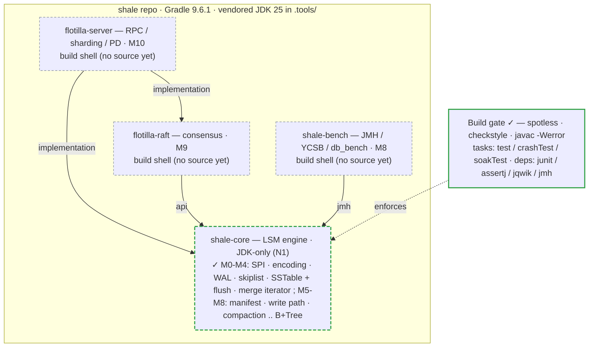
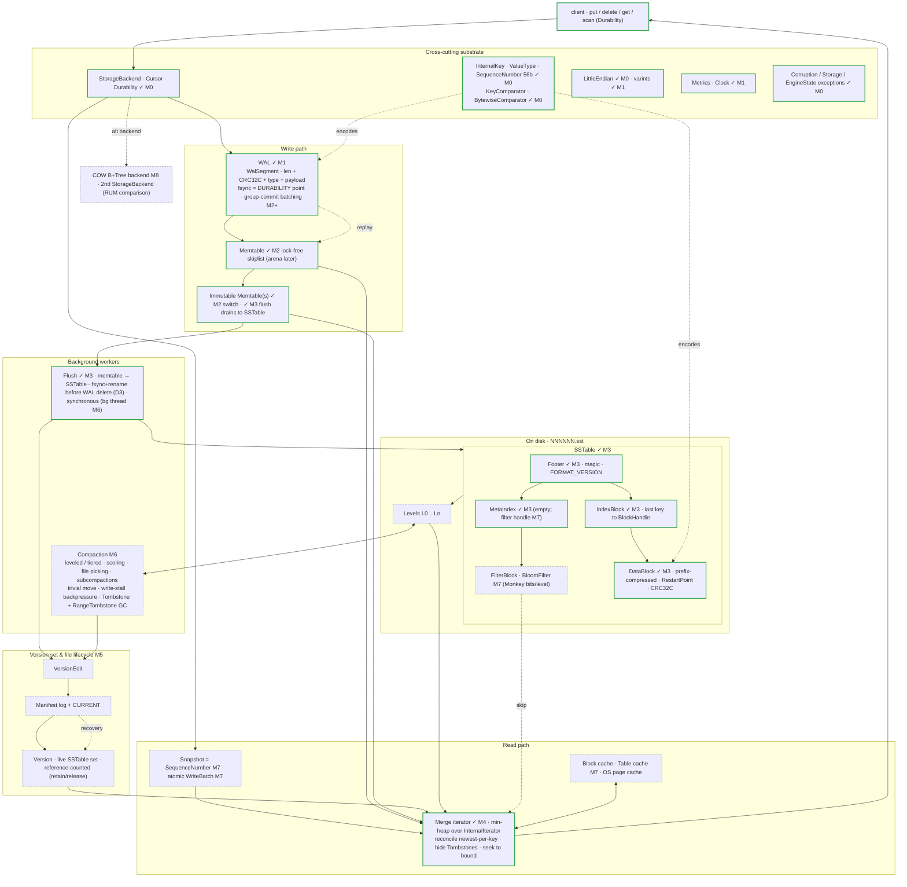
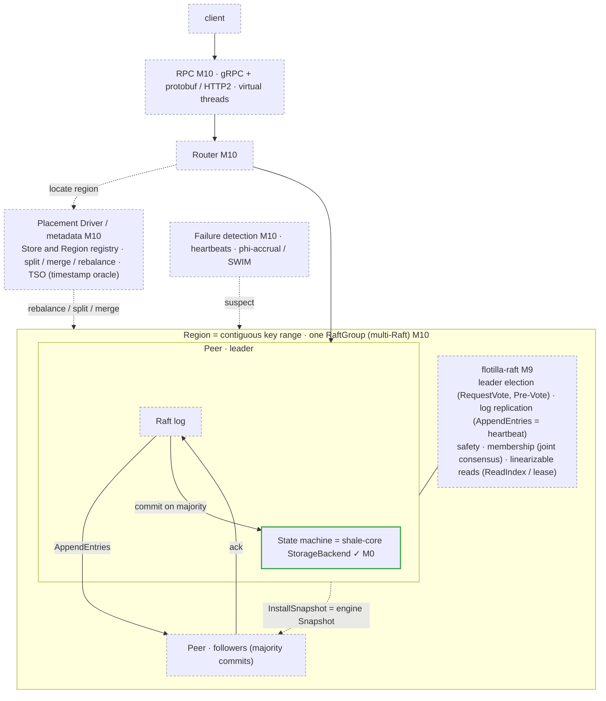
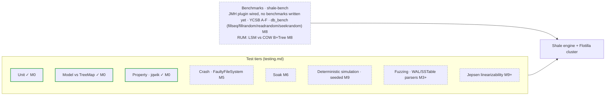

# The complete project scope

The whole system, built and planned, in one place. Every box is a component from the
project's own inventory ([`../roadmap/shale-roadmap.md`](../roadmap/shale-roadmap.md)) —
nothing is invented. These four diagrams are the *scope* view: they show where each piece
will sit. For what is actually implemented, read the per-milestone as-built pages indexed in
[README.md](README.md).

**Legend:** solid box / `✓ Mn` = in the code now, built at milestone *Mn*. Dashed box + `Mn`
= defined in the [roadmap](../../README.md#roadmap) and not yet written. Today `shale-core`
is built through M4; `shale-bench`, `flotilla-raft`, and `flotilla-server` are empty build
shells.

### 1 · Modules, dependency direction, and the build gate

`shale-core` depends on nothing but the JDK; the other three depend inward only — the arrows
are enforced in each module's `build.gradle.kts`, not by convention. `shale-core` is built
through M4 (dashed border: M5-M8 remain); everything else is a shell awaiting its milestone.

### 2 · Shale — the single-node engine (full component scope)

Write path, on-disk format, background work, version/recovery, and read path — every
component from the engine inventory. Only the cross-cutting substrate (SPI, key encoding,
comparators, coding, exceptions) is built; the rest is milestone-tagged.

### 3 · Flotilla — the distributed store (full component scope)

The engine becomes the replicated state machine behind Raft; a router and placement driver
shard the key space into Regions, each its own Raft group. All planned (M9–M10); the state
machine is the M0 engine. Percolator (M11) is a non-goal and is not drawn.

### 4 · Verification & benchmarking (full scope)

### 5 · As-built detail (per milestone)

The finer-grained diagrams of what actually exists in the code — the `shale-core` type graph,
the model harness, and each milestone's internals — are indexed in
[README.md](README.md), organised by milestone so they grow with the code.
