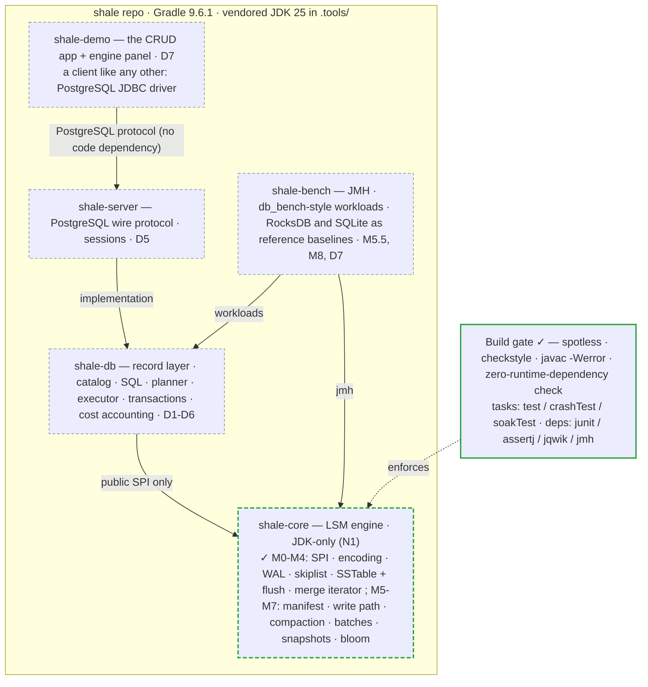
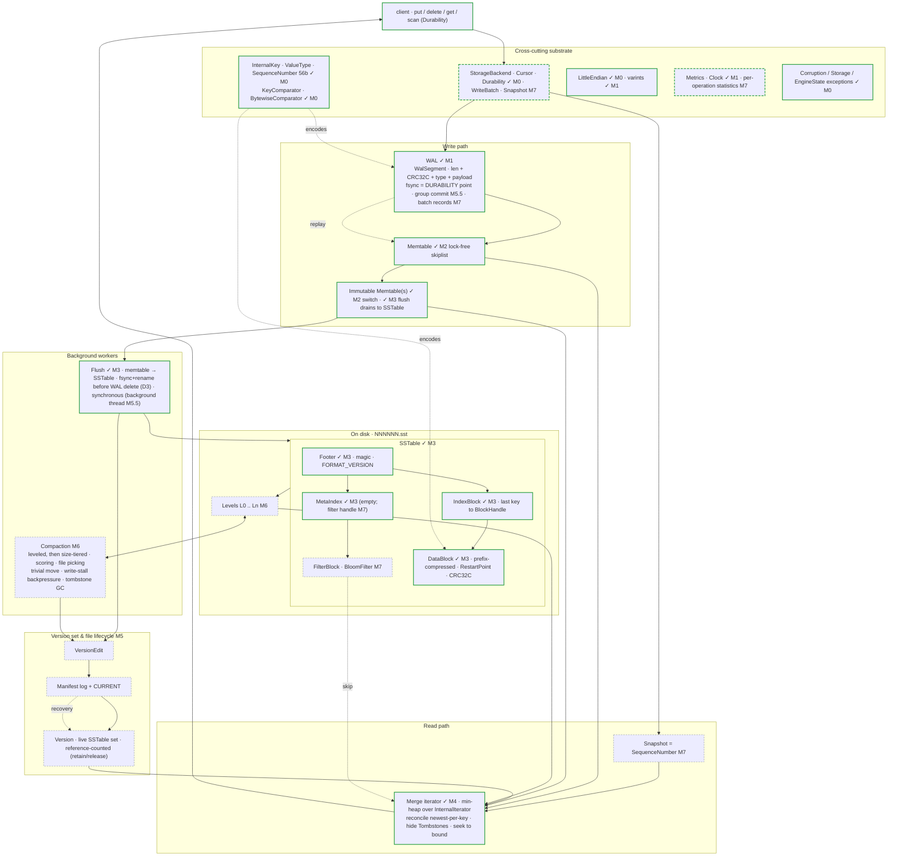
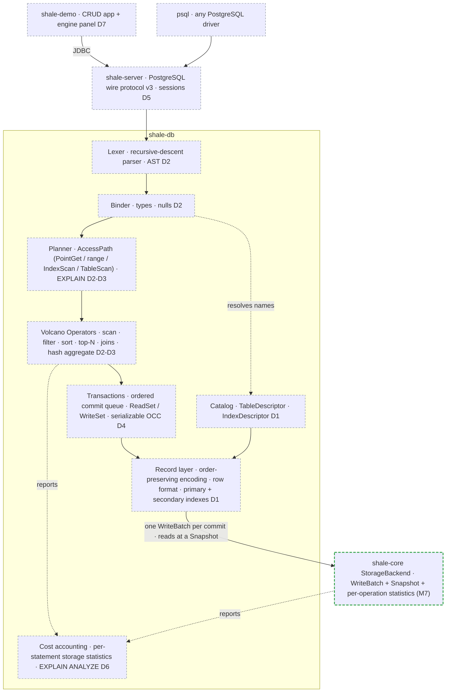
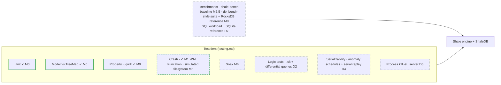

# The complete project scope

The whole system, built and planned, in one place: modules, the engine, the database layer, and
verification. These diagrams are the *scope* view; for what is actually implemented, read the
per-milestone as-built pages indexed in [README.md](README.md). The purpose behind the scope is
the [charter](../roadmap/charter.md); the order it is built in is the
[completion plan](../roadmap/completion-plan.md).

**Legend:** solid box / `✓ Mn` = in the code now, built at milestone *Mn*. Dashed box + a
milestone = planned and not yet written. Today `shale-core` is built through M4, `shale-bench`
is an empty harness, and the ShaleDB modules do not exist yet.

### 1 · Modules, dependency direction, and the build gate

```mermaid
flowchart TB
  subgraph repo["shale repo · Gradle 9.6.1 · vendored JDK 25 in .tools/"]
    demo["shale-demo — the CRUD app + engine panel · D7<br/>a client like any other: PostgreSQL JDBC driver"]:::plan
    server["shale-server — PostgreSQL wire protocol · sessions · D5"]:::plan
    sdb["shale-db — record layer · catalog · SQL · planner · executor · transactions · cost accounting · D1-D6"]:::plan
    core["shale-core — LSM engine · JDK-only (N1)<br/>✓ M0-M4: SPI · encoding · WAL · skiplist · SSTable + flush · merge iterator ; M5-M7: manifest · write path · compaction · batches · snapshots · bloom"]:::part
    bench["shale-bench — JMH · db_bench-style workloads · RocksDB and SQLite as reference baselines · M5.5, M8, D7"]:::plan
  end
  demo -->|"PostgreSQL protocol (no code dependency)"| server
  server -->|implementation| sdb
  sdb -->|public SPI only| core
  bench -->|jmh| core
  bench -->|workloads| sdb
  gate["Build gate ✓ — spotless · checkstyle · javac -Werror · zero-runtime-dependency check<br/>tasks: test / crashTest / soakTest · deps: junit / assertj / jqwik / jmh"]:::done
  gate -. enforces .-> core

  classDef done stroke:#2ea043,stroke-width:2px;
  classDef part stroke:#2ea043,stroke-width:2px,stroke-dasharray:6 3;
  classDef plan stroke:#8b949e,stroke-width:1px,stroke-dasharray:4 3;
```

Every module depends inward only, and the arrows are enforced in each module's
`build.gradle.kts`, not by convention. `shale-core` is built through M4 (dashed border: M5–M7
remain). `shale-db` and `shale-server` carry zero runtime dependencies, like the engine. The demo
and the benchmark baselines are the two deliberate exceptions (ADR-0013).

### 2 · Shale — the storage engine (full component scope)

Write path, on-disk format, background work, version/recovery, and read path. The substrate
(SPI, key encoding, coding, exceptions) and the M1–M4 path are built; the rest is milestone-tagged.

```mermaid
flowchart TB
  client["client · put / delete / get / scan (Durability)"]:::done

  subgraph xcut["Cross-cutting substrate"]
    spi["StorageBackend · Cursor · Durability ✓ M0 · WriteBatch · Snapshot M7"]:::part
    keyz["InternalKey · ValueType · SequenceNumber 56b ✓ M0<br/>KeyComparator · BytewiseComparator ✓ M0"]:::done
    codez["LittleEndian ✓ M0 · varints ✓ M1"]:::done
    obs["Metrics · Clock ✓ M1 · per-operation statistics M7"]:::part
    errs["Corruption / Storage / EngineState exceptions ✓ M0"]:::done
  end

  subgraph wpath["Write path"]
    wal["WAL ✓ M1<br/>WalSegment · len + CRC32C + type + payload<br/>fsync = DURABILITY point · group commit M5.5 · batch records M7"]:::done
    mem["Memtable ✓ M2 lock-free skiplist"]:::done
    imm["Immutable Memtable(s) ✓ M2 switch · ✓ M3 flush drains to SSTable"]:::done
  end

  subgraph bg["Background workers"]
    flush["Flush ✓ M3 · memtable → SSTable · fsync+rename before WAL delete (D3) · synchronous (background thread M5.5)"]:::done
    comp["Compaction M6<br/>leveled, then size-tiered · scoring · file picking<br/>trivial move · write-stall backpressure · tombstone GC"]:::plan
  end

  subgraph store["On disk · NNNNNN.sst"]
    subgraph sstable["SSTable ✓ M3"]
      ft["Footer ✓ M3 · magic · FORMAT_VERSION"]:::done
      idx["IndexBlock ✓ M3 · last key to BlockHandle"]:::done
      mi["MetaIndex ✓ M3 (empty; filter handle M7)"]:::done
      fb["FilterBlock · BloomFilter M7"]:::plan
      db["DataBlock ✓ M3 · prefix-compressed · RestartPoint · CRC32C"]:::done
    end
    lvl["Levels L0 .. Ln M6"]:::plan
  end

  subgraph vers["Version set & file lifecycle M5"]
    edit["VersionEdit"]:::plan
    man["Manifest log + CURRENT"]:::plan
    ver["Version · live SSTable set · reference-counted (retain/release)"]:::plan
  end

  subgraph rpath["Read path"]
    snap["Snapshot = SequenceNumber M7"]:::plan
    merge["Merge iterator ✓ M4 · min-heap over InternalIterator<br/>reconcile newest-per-key · hide Tombstones · seek to bound"]:::done
  end

  client --> spi
  spi --> wal
  wal --> mem
  mem --> imm
  imm --> flush
  flush --> sstable
  sstable --> lvl
  ft --> idx
  ft --> mi
  idx --> db
  mi --> fb
  flush --> edit
  comp --> edit
  lvl <--> comp
  edit --> man
  man --> ver
  spi --> snap
  snap --> merge
  mem --> merge
  imm --> merge
  ver --> merge
  lvl --> merge
  fb -. skip .-> merge
  merge --> client
  man -. recovery .-> ver
  wal -. replay .-> mem
  keyz -. encodes .-> wal
  keyz -. encodes .-> db

  classDef done stroke:#2ea043,stroke-width:2px;
  classDef part stroke:#2ea043,stroke-width:2px,stroke-dasharray:6 3;
  classDef plan stroke:#8b949e,stroke-width:1px,stroke-dasharray:4 3;
```

### 3 · ShaleDB — the database layer (full component scope)

A relational database on the engine's public `StorageBackend` interface (ADR-0013). Rows and
indexes are encoded into ordered keys; SQL is parsed and planned into Volcano operators;
transactions validate optimistically over engine snapshots. Every operator and engine call
reports into one per-statement cost record, which `EXPLAIN ANALYZE` prints. All planned (D1–D7).

```mermaid
flowchart TB
  app["shale-demo · CRUD app + engine panel D7"]:::plan
  psql["psql · any PostgreSQL driver"]:::plan
  wire["shale-server · PostgreSQL wire protocol v3 · sessions D5"]:::plan

  subgraph db["shale-db"]
    parse["Lexer · recursive-descent parser · AST D2"]:::plan
    bind["Binder · types · nulls D2"]:::plan
    plan["Planner · AccessPath (PointGet / range / IndexScan / TableScan) · EXPLAIN D2-D3"]:::plan
    exec["Volcano Operators · scan · filter · sort · top-N · joins · hash aggregate D2-D3"]:::plan
    txn["Transactions · ordered commit queue · ReadSet / WriteSet · serializable OCC D4"]:::plan
    cat["Catalog · TableDescriptor · IndexDescriptor D1"]:::plan
    rec["Record layer · order-preserving encoding · row format · primary + secondary indexes D1"]:::plan
    cost["Cost accounting · per-statement storage statistics · EXPLAIN ANALYZE D6"]:::plan
  end

  spi["shale-core StorageBackend · WriteBatch + Snapshot + per-operation statistics (M7)"]:::part

  app -->|JDBC| wire
  psql --> wire
  wire --> parse
  parse --> bind
  bind --> plan
  plan --> exec
  exec --> txn
  bind -. resolves names .-> cat
  txn --> rec
  cat --> rec
  rec -->|"one WriteBatch per commit · reads at a Snapshot"| spi
  exec -. reports .-> cost
  spi -. reports .-> cost

  classDef part stroke:#2ea043,stroke-width:2px,stroke-dasharray:6 3;
  classDef plan stroke:#8b949e,stroke-width:1px,stroke-dasharray:4 3;
```

### 4 · Verification and benchmarking (full scope)

```mermaid
flowchart LR
  subgraph tiers["Test tiers (testing.md)"]
    unit["Unit ✓ M0"]:::done
    modelt["Model vs TreeMap ✓ M0"]:::done
    prop["Property · jqwik ✓ M0"]:::done
    crash["Crash · ✓ M1 WAL truncation · simulated filesystem M5"]:::part
    soak["Soak M6"]:::plan
    logic["Logic tests · .slt + differential queries D2"]:::plan
    serial["Serializability · anomaly schedules + serial replay D4"]:::plan
    kill["Process kill -9 · server D5"]:::plan
  end
  bench["Benchmarks · shale-bench<br/>baseline M5.5 · db_bench-style suite + RocksDB reference M8<br/>SQL workload + SQLite reference D7"]:::plan
  target["Shale engine + ShaleDB"]
  tiers --> target
  bench --> target

  classDef done stroke:#2ea043,stroke-width:2px;
  classDef part stroke:#2ea043,stroke-width:2px,stroke-dasharray:6 3;
  classDef plan stroke:#8b949e,stroke-width:1px,stroke-dasharray:4 3;
```

### 5 · As-built detail (per milestone)

The finer-grained diagrams of what actually exists in the code — the `shale-core` type graph, the
model harness, and each milestone's internals — are indexed in [README.md](README.md), organised
by milestone so they grow with the code.
