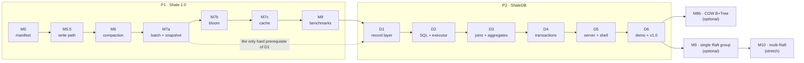

# Completion plan — from M4 to the v1.0 portfolio release, and beyond

**Status:** the working plan of record, adopted 2026-09-26. **Starts from:** `main` at `9cfa7d6`,
M0–M4 complete, `./gradlew build crashTest` green on JDK 25 (161 tests; see the
[2026-09-26 assessment](../assessments/2026-09-26-verified-baseline-and-shaledb-direction.md)).
**Decision behind the scope:** [ADR-0013](../adr/0013-build-shaledb-relational-layer.md).

This is the one page that orders everything left to build. Each milestone has its own plan file
(linked below) with its decisions, task order and acceptance gates. Pick up the first milestone
whose status is not ✅ and follow its plan; nothing else needs deciding first.

## 1. What "finished" means

Four products, built in order. **v1.0 = P1 + P2**; that is the portfolio release. P3 and P4 are
optional capstones, built only if there is appetite after v1.0.

| Product | Milestones | The claim it earns |
|---|---|---|
| **P1 — Shale 1.0, a measured engine** | M5, M5.5, M6, M7a–c, M8 | "I wrote a crash-consistent LSM engine and measured its read/write/space tradeoffs." |
| **P2 — ShaleDB, a database on it** | D1–D6 | "A CRUD app runs on SQL, a planner, an executor and serializable transactions I wrote, over my engine — and survives `kill -9`." |
| **P3 — The RUM capstone** *(optional)* | M8b | "The same SQL layer runs on an LSM and a copy-on-write B+Tree I wrote; here is the measured tradeoff." |
| **P4 — Flotilla** *(optional)* | M9, M10 *(stretch)* | "My engine is the replicated state machine behind a Raft I wrote." |

M11 (Percolator) stays a non-goal.

## 2. The order

The order is strict, as the charter requires; each milestone ends in a tested, tagged artifact.
The one sanctioned reorder is the **fast-track** in §7.

## 3. Milestones

Estimates are focused weeks at a hobby pace, taken from the charter and the Sept 7 critique.
M0–M4 took about 2.5 active weeks against a charter estimate of 3–6, so recalibrate after M5 (§8).

| Id | Milestone | Plan | Needs | ADR | Format change (N2) | New module | Est. | Tag |
|---|---|---|---|---|---|---|---|---|
| M5 | Manifest + recovery hardening | [plan](m5-manifest-and-recovery.md) | M4 | 0012 | manifest v1 | — | 3–4 | `m5-manifest` |
| M5.5 | Concurrent write path | [plan](m5-5-concurrent-write-path.md) | M5 | yes | — | — | 2–3 | `m5.5-write-path` |
| M6 | Compaction | [plan](m6-compaction.md) | M5.5 | yes | manifest (if not reserved in M5) | — | 4–6 | `m6-compaction` |
| M7a | Atomic batches + snapshots | [plan](m7-filters-cache-mvcc.md) | M6 | yes | WAL payload v2 | — | 2 | `m7a-mvcc` |
| M7b | Bloom filters | [plan](m7-filters-cache-mvcc.md) | M7a | yes | SSTable v2 | — | 1–2 | `m7b-bloom` |
| M7c | Block + table cache | [plan](m7-filters-cache-mvcc.md) | M7b | yes | — | — | 1–2 | `m7c-cache` |
| M8 | Benchmark suite, engine measured | [plan](m8-benchmark-suite.md) | M7c | — | — | — | 2–3 | `shale-1.0` |
| D1 | Record layer: encoding, rows, catalog | [plan](d1-record-layer.md) | M8 | yes | key + row v1 | `shale-db` | 2–3 | `d1-record` |
| D2 | SQL front end + single-table execution | [plan](d2-sql-and-execution.md) | D1 | yes | — | — | 3–4 | `d2-sql` |
| D3 | Joins, aggregates, ordering | [plan](d3-joins-aggregates-ordering.md) | D2 | — | — | — | 2–3 | `d3-query` |
| D4 | Serializable transactions | [plan](d4-transactions.md) | D3 | yes | — | — | 2–3 | `d4-txn` |
| D5 | Server, protocol, shell | [plan](d5-server-and-shell.md) | D4 | yes | protocol v1 (wire) | `shale-server` | 2 | `d5-server` |
| D6 | CRUD demo + v1.0 launch | [plan](d6-crud-demo-and-launch.md) | D5 | — | — | `shale-demo` | 2–3 | **`v1.0`** |
| M8b | COW B+Tree capstone *(optional)* | [plan](m8b-cow-btree-capstone.md) | D6 | yes | B+Tree page v1 | `shale-btree` | ≤4 | `m8b-btree` |
| M9 | Single Raft group *(optional)* | [plan](m9-single-raft-group.md) | D6 | yes | Raft log v1 | (fill `flotilla-raft`) | 6–10 | `m9-raft` |
| M10 | Multi-Raft sharding *(stretch)* | [plan](m10-multi-raft-sharding.md) | M9 | yes | RPC schema | (fill `flotilla-server`) | 6–10 | `m10-shards` |

**Totals:** P1 ≈ 15–22 weeks, P2 ≈ 13–18 → **v1.0 ≈ 28–40 focused weeks** on the charter's
estimates, or roughly half that at the M0–M4 pace. With every cut in §7 taken: ≈ 23–34.

## 4. How to execute any milestone

This loop is the whole process; it restates `commits.md` §5 and `documentation.md` §6 in order.

1. Branch `mNN/<slug>` (engine) or `dNN/<slug>` (ShaleDB) from an up-to-date `main`.
2. Read the milestone plan, the packages it touches (`package-info.java`, `format.md`) and the
   ADRs it cites.
3. **Decision first:** write the milestone's ADR as `Proposed`, settle every item in the plan's
   "Decisions" list, and mark it `Accepted` before any implementation commit.
4. **Format first:** for any new bytes, write `format.md`, then the golden fixture and round-trip
   and bit-flip tests, then the encoder. Commit with `Format-Change:` and `Reversible: no`.
5. Implement in the plan's task order: TDD, one logical change per commit, each commit green.
6. Satisfy every acceptance gate with a test, not with prose.
7. Docs: `package-info` + Javadoc with N9 citations, glossary rows, the
   `architecture/<id>-*.md` as-built page with validated Mermaid, the release note, and the
   README status table.
8. `./gradlew build crashTest` green (plus `soakTest` from M6). Merge, tag, delete the branch.
9. Update the status table in §9 of this file, and record actual versus estimated weeks.

If a task seems to need a later milestone's work, stop and say so (CLAUDE.md §5) instead of
building a placeholder.

## 5. Decisions still to make

Every open decision is listed here with the milestone that makes it. Each milestone plan carries
the decision checklist and a recommended option; the ADR records the final answer.

| When | ADR subject | Recommended direction (the plan has the detail) |
|---|---|---|
| M5 | 0012 — manifest, Version lifecycle, recovery, failure/close semantics | as in the M5 plan; also reserve per-file level and compaction pointers |
| M5.5 | Write-path watermarks, group commit leader, background flush, stalls | LevelDB writer queue (ADR-0008's B2), fail-stop on fsync error |
| M6 | Compaction strategy, level invariants, point-lookup order, `ShaleOptions` | leveled first (LevelDB), size-tiered second for comparison |
| M7a | `WriteBatch` + `Snapshot` SPI and the batch WAL record | one WAL record per batch; visible-sequence watermark |
| M7b | Filter block format and hash | whole-table filter, double hashing, 10 bits/key default |
| M7c | Cache structure and eviction | sharded LRU block cache + bounded table cache |
| D1 | Relational data layout: key encoding, keyspaces, row format, catalog | FoundationDB-tuple-style encoding, CockroachDB-style keys |
| D2 | SQL dialect, type system, null semantics, planner shape | a documented subset, strict types, rule-based access paths |
| D4 | Concurrency control and isolation level | optimistic, backward validation, serializable |
| D5 | Protocol and server threading | HTTP/JSON on `jdk.httpserver`, virtual threads, hand-written JSON |
| M8b | B+Tree page format and commit protocol | LMDB-style dual meta pages, fixed 4 KiB pages |
| M9 | Raft persistence, RPC stack, snapshot transfer, ShaleDB placement | simulated network first, hand-rolled framing over JDK sockets |

## 6. Cross-cutting schedules

**Public API changes to `shale-core`** (each needs its ADR; `Reversible:` trailer): M5 closed-state
and repeated-close semantics · M6 `ShaleOptions` for `Shale.open` · M7a `write(WriteBatch,
Durability)`, `snapshot()`, snapshot-taking `get`/`scan` overloads · M7b–c option fields only.

**Test tiers come alive:** crash fault injection (`FaultyFileSystem`-style seam) at M5 · soak
at M6 · ShaleDB logic tests (`.slt`) at D2 · process-level `kill -9` test at D5 · deterministic
simulation at M9. The `testing.md` table tracks them.

**Metrics a reviewer will see:** write/read/space amplification (M6), filter false-positive rate
(M7b), cache hit rate (M7c), group-commit batch size (M5.5), commits and aborts (D4). The
server's `/v1/metrics` exposes them (D5), and the demo's engine panel draws them (D6).

## 7. Cut lines

**Fast-track (the sanctioned reorder).** If the demo matters more than completeness: after M7a,
go straight to D1–D6 and ship v1.0, then return to M7b, M7c and M8. D1 only hard-requires M7a.
Note the release as "v1.0 without filters/cache"; update §9 and the README honestly.

**If time runs short, cut in this order** (least loss first): M7c cache → size-tiered as a second
policy (compare memtable size and bloom bits instead) → YCSB workloads (keep db_bench-style) →
D3 outer joins, `HAVING`, `DISTINCT` → server session paging. **Never cut:** M5, M6, M7a, D4's
serializable commit, or the D5/D6 crash demonstrations. Those carry the project's claims.

## 8. Risks

| Risk | Guard |
|---|---|
| Compaction and flush races corrupt the file set | the M5 fault seam plus M6's crash-at-every-operation gates, and soak runs before tags |
| SQL scope creep (the classic trap) | each D-plan freezes its grammar; anything else is written down as stretch, not built |
| OCC and snapshot interaction bugs | D4's write-skew, phantom and serial-replay checks run in every build |
| Estimates slip | recalibrate after M5 and M6; use the §7 cuts rather than stretching the schedule |
| CI flakiness from network (Maven Central 429s seen 2026-09-26) | Gradle dependency cache in CI; a retry in CI only on dependency resolution, never on tests |

## 9. Status

| Id | Status | Estimate (weeks) | Actual | Notes |
|---|---|---|---|---|
| M0–M4 | ✅ | 3–6 | ~2.5 | tag `m4-merge` |
| M5 | ⏭ next | 3–4 | | write ADR-0012 first |
| M5.5 · M6 · M7a–c · M8 | ☐ | 12–18 | | |
| D1–D6 | ☐ | 13–18 | | |
| M8b · M9 · M10 | ☐ optional | | | |
