# Completion plan — from M4 to the v1.0 portfolio release

> **Draft under revision (2026-09-26).** A whole-project critique raised open decisions that
> change this plan: the target timeline (lean or full), the PostgreSQL wire protocol replacing
> the HTTP/JSON server, dropping Flotilla ([ADR-0014](../adr/0014-drop-flotilla-from-scope.md),
> *Proposed*), the COW B+Tree and the block cache, slimming the documentation, and benchmark-only
> reference baselines. Until the owner decides, treat everything after M5 as provisional. M5 and
> its plan are unaffected.

**Status:** the working plan of record, adopted 2026-09-26 and re-validated the same day (§3
records why each step is here). **Starts from:** `main` at `9cfa7d6`, M0–M4 complete,
`./gradlew build crashTest` green on JDK 25 (161 tests; see the
[2026-09-26 assessment](../assessments/2026-09-26-verified-baseline-and-shaledb-direction.md)).
**Scope decisions:** [ADR-0013](../adr/0013-build-shaledb-relational-layer.md) (build ShaleDB on the
engine) and [ADR-0014](../adr/0014-drop-flotilla-from-scope.md) (drop Flotilla).

This is the one page that orders everything left to build. Each milestone has its own plan file
with its decisions, recommended answers, task order and acceptance gates. Pick up the first
milestone whose status in §10 is not ✅ and follow its plan.

## 1. What "finished" means

**The claim v1.0 earns:** *"I built a database from first principles — an LSM storage engine
with compaction and bloom filters, and a SQL layer with a planner, an executor and serializable
transactions on top — measured its tradeoffs, and a CRUD app runs on it and survives `kill -9`."*

| Product | Milestones | Stopping point it gives you |
|---|---|---|
| **P1 — Shale 1.0, a measured engine** | S0, M5, M5.5, M6, M7a, M7b, M8 | A complete LSM engine with published numbers — a strong project on its own |
| **P2 — ShaleDB, a database on it** | D1–D6 | **v1.0**: SQL, transactions, a server and a CRUD demo on the engine |
| **Optional after v1.0** | M7c (cache), M8b (COW B+Tree) | Extra depth, only if there is appetite |

**Out of scope:** Flotilla (M9, M10; ADR-0014) and Percolator (M11). If distribution is wanted
later, it becomes a separate project, starting from the plans in `roadmap/archive/`.

**Portfolio checkpoints.** The project is resume-ready at each of these, with the README updated
to match: after **M6** ("an LSM engine with compaction"), after **M8** (Shale 1.0, measured),
after **D4** (an embedded SQL database with serializable transactions), and at **v1.0** (the
demo). Stopping at any checkpoint still leaves a finished, honest artifact.

## 2. The order

```mermaid
flowchart LR
  s0["S0<br/>housekeeping"] --> m5["M5<br/>manifest"]
  subgraph p1["P1 · Shale 1.0"]
    m5 --> m55["M5.5<br/>write path"] --> m6["M6<br/>compaction"] --> m7a["M7a<br/>batch + snapshot"] --> m7b["M7b<br/>bloom"] --> m8["M8<br/>benchmarks"]
  end
  subgraph p2["P2 · ShaleDB → v1.0"]
    d1["D1<br/>record layer"] --> d2["D2<br/>SQL + executor"] --> d3["D3<br/>joins + aggregates"] --> d4["D4<br/>transactions"] --> d5["D5<br/>server + shell"] --> d6["D6<br/>demo + v1.0"]
  end
  m8 --> d1
  d6 --> opt["optional: M7c cache · M8b B+Tree"]
```

The order is strict; each milestone ends in a tested, tagged artifact. §3 explains why P1 comes
before P2 and gives the one sanctioned reorder (the fast-track).

## 3. Why each step is here — the decision log

Every step was re-examined against the v1.0 claim in §1. **Keep** means it is needed for that
claim; **cut candidate** means it can go under time pressure (§8); **moved** or **dropped**
means the plan changed, and why.

| Step | Verdict | Reasoning |
|---|---|---|
| **S0** housekeeping | **Added** | Removes the empty Flotilla shells (ADR-0014). Makes the toolchain bootstrap part of the agent guide, so a fresh session can build. Hours, not weeks. |
| **M5** manifest | **Keep — essential** | Without a manifest of live files, no file can ever be deleted safely, so compaction is impossible. Also fixes the known lifecycle gaps: operations after `close`, the six-digit file-number limit, no directory fsync. |
| **M5.5** write path | **Keep** background flush + stalls; **group commit is a cut candidate** | M6 needs flush off the write path. Engine group commit is classic and measurable (E4). But D4 batches concurrent transactions at the database layer anyway (its ordered commit queue), so the demo does not depend on it. If cut, `Durability.GROUP` stays documented as `SYNC`. |
| **M6** compaction | **Keep — essential**; size-tiered as a second policy is a cut candidate | Compaction is what makes this an LSM engine and bounds disk use. Leveled first: it has the clearest reference (LevelDB) and it is what ShaleDB runs on. The second policy exists only to make the tradeoff measurable. |
| **M7a** batches + snapshots | **Keep — essential** | ShaleDB's correctness rests on it: a row and its index entries commit atomically, and every query reads one consistent state. |
| **M7b** bloom filters | **Keep** | 1–2 weeks and a classic interview topic. Every SQL `INSERT` first checks that its primary key is *absent*, and a missing-key lookup is exactly what a filter makes cheap. |
| **M7c** block/table cache | **Moved to optional after v1.0** | The OS page cache already holds hot file pages; a block cache saves decode and CRC work, which matters at scales the demo never reaches. Kept as an optional depth item with its benchmark (E3). |
| **M8** benchmarks | **Keep** (trimmed) | The charter's thesis is a measured tradeoff; without numbers it is only asserted. It is also the natural end of P1, a complete stopping point. YCSB is a cut candidate; db_bench-style workloads alone carry the story. |
| **P1 before P2** | **Keep the order** | The fast-track (M7a → D-track, then M7b and M8) reaches the demo 3–5 weeks sooner. But finishing P1 first leaves a complete, measured engine behind if the SQL work stalls — and the SQL work is where scope risk lives. |
| **D1** record layer | **Keep — essential** | The table→key-value mapping is the core idea of a database on an ordered store (MyRocks, CockroachDB). |
| **D2** SQL + executor | **Keep — essential** | The query-engine half of "a complete database". Its grammar is frozen, to stop scope creep. |
| **D3** joins + aggregates | **Keep** core; outer joins, `HAVING` and `DISTINCT` are cut candidates | The demo's loan list is a join and its stats page is a `GROUP BY`. The rest is completeness, not proof. |
| **D4** transactions | **Keep — essential** | Serializable isolation you can falsify with a test is the most interview-worthy part of the database layer, and the demo's checkout needs it. |
| **D5** server + shell | **Keep** | A database is something you connect to. Embedded-only (like SQLite) would save 2 weeks but lose the process-level `kill -9` test, which is the charter's own durability criterion. |
| **D6** demo + launch | **Keep — essential** | It is what makes the rest visible. The launch checklist is what a reviewer actually reads. |
| **M8b** COW B+Tree | **Optional after v1.0** | The SPI's original purpose (ADR-0006), and the only capstone left. Running the same SQL on both backends is a sharp demonstration — but it is not needed for the v1.0 claim. |
| **M9, M10** Flotilla | **Dropped** (ADR-0014) | Not needed for the goal; 12–20 weeks; the least differentiated component; empty modules cost credibility. |

## 4. Milestones

Estimates are focused weeks at a hobby pace, from the charter and the Sept 7 critique. M0–M4 took
about 2.5 active weeks against a charter estimate of 3–6, so recalibrate after M5 (§10).

| Id | Milestone | Plan | Needs | ADR | Format change (N2) | New module | Est. | Tag |
|---|---|---|---|---|---|---|---|---|
| S0 | Scope housekeeping | §6 below | — | 0014 | — | removes 2 shells | <1 | — |
| M5 | Manifest + recovery hardening | [plan](m5-manifest-and-recovery.md) | M4 | 0012 | manifest v1 | — | 3–4 | `m5-manifest` |
| M5.5 | Concurrent write path | [plan](m5-5-concurrent-write-path.md) | M5 | yes | — | — | 2–3 | `m5.5-write-path` |
| M6 | Compaction | [plan](m6-compaction.md) | M5.5 | yes | none if M5 reserved the fields | — | 4–6 | `m6-compaction` |
| M7a | Atomic batches + snapshots | [plan](m7-filters-cache-mvcc.md) | M6 | yes | WAL v2 | — | 2 | `m7a-mvcc` |
| M7b | Bloom filters | [plan](m7-filters-cache-mvcc.md) | M7a | yes | SSTable v2 | — | 1–2 | `m7b-bloom` |
| M8 | Benchmark suite, engine measured | [plan](m8-benchmark-suite.md) | M7b | — | — | — | 2–3 | `shale-1.0` |
| D1 | Record layer: encoding, rows, catalog | [plan](d1-record-layer.md) | M8 | yes | key + row v1 | `shale-db` | 2–3 | `d1-record` |
| D2 | SQL front end + single-table execution | [plan](d2-sql-and-execution.md) | D1 | yes | — | — | 3–4 | `d2-sql` |
| D3 | Joins, aggregates, ordering | [plan](d3-joins-aggregates-ordering.md) | D2 | — | — | — | 2–3 | `d3-query` |
| D4 | Serializable transactions | [plan](d4-transactions.md) | D3 | yes | — | — | 2–3 | `d4-txn` |
| D5 | Server, protocol, shell | [plan](d5-server-and-shell.md) | D4 | yes | protocol v1 (wire) | `shale-server` | 2 | `d5-server` |
| D6 | CRUD demo + v1.0 launch | [plan](d6-crud-demo-and-launch.md) | D5 | — | — | `shale-demo` | 2–3 | **`v1.0`** |
| M7c | Block + table cache *(optional)* | [plan](m7-filters-cache-mvcc.md) | v1.0 | yes | — | — | 1–2 | `m7c-cache` |
| M8b | COW B+Tree capstone *(optional)* | [plan](m8b-cow-btree-capstone.md) | v1.0 | yes | B+Tree page v1 | `shale-btree` | ≤4 | `m8b-btree` |

**Totals:** P1 ≈ 14–20 weeks, P2 ≈ 13–18 → **v1.0 ≈ 27–38 focused weeks** on the charter's
estimates, or roughly half that at the M0–M4 pace. With every cut in §8 taken: ≈ 23–33.

## 5. How to execute any milestone

This loop is the whole process; it restates `commits.md` §5 and `documentation.md` §6 in order.

1. Set up the toolchain once per machine: `./scripts/bootstrap.sh && source scripts/env.sh`
   (the system JDK is not used; see `CONTRIBUTING.md`).
2. Branch `mNN/<slug>` (engine) or `dNN/<slug>` (ShaleDB) from an up-to-date `main`.
3. Read the milestone plan, the packages it touches (`package-info.java`, `format.md`) and the
   ADRs it cites.
4. **Decision first:** write the milestone's ADR as `Proposed`, settle every item in the plan's
   decision list (each plan gives a recommended answer), and mark it `Accepted` before any
   implementation commit.
5. **Format first:** for any new bytes, write `format.md`, then the golden fixture and the
   round-trip and bit-flip tests, then the encoder. Commit with `Format-Change:` and
   `Reversible: no`.
6. Implement in the plan's task order: TDD, one logical change per commit, each commit green.
7. Satisfy every acceptance gate with a test, not with prose.
8. Docs: `package-info` + Javadoc with N9 citations, glossary rows, the
   `architecture/<id>-*.md` as-built page with validated Mermaid, the release note, and the
   README status table.
9. `./gradlew build crashTest` green (plus `soakTest` from M6). Merge, tag, delete the branch.
10. Update the status table in §10, recording actual versus estimated weeks.

If a task seems to need a later milestone's work, stop and say so (CLAUDE.md §5) instead of
building a placeholder.

## 6. S0 — scope housekeeping (before M5)

One branch, `build/drop-flotilla-shells`, two commits:
1. `build(build)`: remove `flotilla-raft` and `flotilla-server` from `settings.gradle.kts` and
   delete both directories. `./gradlew build crashTest` stays green (nothing depends on them).
2. `docs(docs)`: the as-built wording that still calls them "shells" (README status table,
   `project-scope.md` §1) now says they were removed; `CLAUDE.md` §2 already reflects ADR-0014.

## 7. Decisions still to make

Each open decision, the milestone that makes it, and the plan's recommended answer. ADR numbers
are assigned when written; 0012 is reserved for M5.

| When | ADR subject | Recommended direction (the plan has the detail) |
|---|---|---|
| M5 | 0012 — manifest, Version lifecycle, recovery, failure/close | LevelDB-style tagged edits in WAL framing; one-time migration of M4 directories; fail-stop writes |
| M5.5 | Write-path watermarks, group commit, background flush, stalls | LevelDB writer queue, one group in flight, fail-stop on fsync error |
| M6 | Compaction strategy, level invariants, point-lookup order, `ShaleOptions` | leveled first (LevelDB), size-tiered second for comparison |
| M7a | `WriteBatch` + `Snapshot` SPI and WAL v2 | one WAL record per batch in a v2 segment; visible-sequence watermark |
| M7b | Filter block format and hash | whole-table filter, double hashing, 10 bits/key default |
| D1 | Relational data layout: encoding, keyspaces, row format, catalog, index states | FoundationDB-tuple-style encoding; CockroachDB-style keys; F1-style index backfill states |
| D2 | SQL dialect, types, nulls, planner shape | a frozen subset, strict types, rule-based access paths, primary key required |
| D4 | Concurrency control and isolation | serializable backward-validation OCC; commits applied in commit order |
| D5 | Protocol, server threading, the `com.sun.net.httpserver` checkstyle exception | HTTP/JSON on `jdk.httpserver`, virtual threads, hand-written JSON |
| M7c, M8b | Cache structure; B+Tree page format and commit protocol | sharded LRU; LMDB-style dual meta pages |

**Public API changes to `shale-core`** (each needs its ADR and a `Reversible:` trailer): M5
closed-state and repeated-close semantics · M6 `ShaleOptions` · M7a `write(WriteBatch,
Durability)`, `snapshot()`, and `get`/`scan` overloads that take a snapshot · M7b option fields.

**Test tiers come alive:** crash fault injection through a simulated filesystem at M5 · soak at
M6 · ShaleDB logic tests (`.slt`) at D2 · a process-level `kill -9` test at D5.

## 8. Cut lines

**Fast-track (the sanctioned reorder).** If the demo matters more than a finished P1: after M7a, go
straight to D1–D6, then return to M7b and M8. Note the release honestly as "v1.0 without filters
or benchmarks" in §10 and the README.

**If time runs short, cut in this order** (least loss first): engine group commit (M5.5) →
size-tiered as a second policy → YCSB workloads (keep db_bench-style) → D3 outer joins, `HAVING`,
`DISTINCT` → server result paging. **Never cut:** M5, M6, M7a, D4's serializable commit, or the
D5/D6 crash demonstrations. Those carry the project's claims.

## 9. Risks

| Risk | Guard |
|---|---|
| Compaction and flush races corrupt the file set | M5's simulated-filesystem crash tests and M6's crash-at-every-operation gates; soak runs before tags |
| SQL scope creep (the classic trap) | each D-plan freezes its grammar; anything else is written down as stretch, not built |
| OCC and snapshot interaction bugs | D4's write-skew, phantom and serial-replay checks run in every build |
| Estimates slip | recalibrate after M5 and M6; take the §8 cuts rather than stretching the schedule |
| CI flakiness from the network (a Maven Central 429 was seen 2026-09-26) | rely on `setup-gradle`'s dependency cache; if 429s recur, add a retry around dependency resolution only, never around tests |

## 10. Status

| Id | Status | Estimate (weeks) | Actual | Notes |
|---|---|---|---|---|
| M0–M4 | ✅ | 3–6 | ~2.5 | tag `m4-merge` |
| S0 | ⏭ next | <1 | | ADR-0014 accepted |
| M5 | ☐ | 3–4 | | write ADR-0012 first |
| M5.5 · M6 · M7a · M7b · M8 | ☐ | 11–16 | | |
| D1–D6 | ☐ | 13–18 | | |
| M7c · M8b | ☐ optional | | | |
