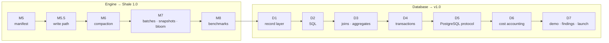

# Completion plan — from M4 to ShaleDB v1.0

**Status:** the working plan of record (2026-09-26; every milestone plan critiqued and rewritten
to implementation level on 2026-09-27). **Starts from:** `main` at `9cfa7d6`:
M0–M4 complete, `./gradlew build crashTest` green on JDK 25 (161 tests). **Why and what:** the
[charter](charter.md) and [ADR-0013](../adr/0013-shaledb-see-through-database.md).

This page orders everything left to build. Pick up the first milestone in §10 that is not ✅ and
follow its plan. **Every plan uses one template:**
- where the code will be at its start;
- the decided design, down to byte layouts, algorithms and error codes;
- a table of the new and changed types;
- branch-sized steps, each with commits, named tests and a "done when";
- the milestone's acceptance gates.

Plans for later milestones name types that earlier ones will create. §5 step 1's reconciliation
pass keeps them true to the code as it actually lands.

## 1. What "finished" means

**The v1.0 claim:** *ShaleDB is a relational database built from scratch in Java. `psql`
connects to it, `EXPLAIN ANALYZE` shows what each statement cost from the plan down to the fsync,
its storage tradeoffs are measured through SQL workloads, and it survives `kill -9` without
losing an acknowledged commit.*

| Phase | Milestones | Ends with |
|---|---|---|
| **Engine** | M5, M5.5, M6, M7, M8 | **Shale 1.0** — a complete, measured LSM engine (tag `shale-1.0`) |
| **Database** | D1–D7 | **ShaleDB v1.0** — SQL, transactions, the PostgreSQL protocol, cost accounting and the demo (tag `v1.0`) |

**Portfolio checkpoints.** Each is a finished, honest artifact if work stops there; update the
README to match at each:
- after **M6** — an LSM engine with compaction;
- after **M8** — Shale 1.0, measured against RocksDB;
- after **D5** — a SQL database `psql` connects to;
- after **D7** — v1.0.

## 2. The order

The order is strict; each milestone ends in a tested, tagged artifact. §8 has the one sanctioned
reorder.

## 3. Why each step is here

Every step was tested against the v1.0 claim: does it make cost **visible**, **measured**, or
**proven**, or is it required for one that does? Scope that failed this test is not in the plan;
ADR-0013 records it and why.

| Step | Why it is in the plan |
|---|---|
| **M5** manifest | Without durable metadata no file can be deleted safely, so compaction is impossible. It also closes the known lifecycle gaps: operations after `close`, the six-digit file-number limit, no directory fsync. |
| **M5.5** write path | A dedicated WAL-writer thread gives group commit, and a submission that never does I/O in the caller's thread, which D4's commit protocol needs. Background flush and write stalls are prerequisites for compaction. The shared fsync is what `EXPLAIN ANALYZE` shows as "shared(*N*)". |
| **M6** compaction | What makes this an LSM engine, and the source of the deferred costs the thesis is about. Leveled first; size-tiered (RocksDB-universal style, which keeps runs in age order) second, so the tradeoff can be measured (E1, F3). |
| **M7** batches, snapshots, bloom, statistics | Atomic batches and snapshots are what a relational layer's correctness rests on. Bloom filters make the duplicate-key check of every `INSERT` cheap. Per-operation statistics are the hook cost accounting needs. |
| **M8** benchmarks, Shale 1.0 | Turns engine claims into numbers, with RocksDB as the reference. Makes the engine operable by someone else: an online checkpoint (backup), an operating guide, a compatibility policy, a released jar. Ends a complete stopping point. |
| **D1** record layer | Tables and indexes as ordered keys — the core idea of SQL on an LSM (MyRocks, CockroachDB). |
| **D2** SQL | The query-engine half of a database. Its grammar is frozen, to stop scope creep. |
| **D3** joins, aggregates | The demo's loan list is a join; its stats page is a `GROUP BY`. |
| **D4** transactions | Serializable isolation, falsifiable by tests; the demo's checkout depends on it. |
| **D5** PostgreSQL protocol | `psql` and standard drivers instead of a custom client — less to build, far more convincing. |
| **D6** cost accounting | The thesis itself: `EXPLAIN ANALYZE` down to the disk. |
| **D7** demo, findings, launch | Makes the claim visible in five minutes, answers the measured questions, and packages it for a reviewer. |

## 4. Milestones

Estimates are focused weeks at a hobby pace. M0–M4 took about 2.5 active weeks against a charter
estimate of 3–6, so recalibrate after M5 (§10).

| Id | Milestone | Plan | ADR | Format change (N2) | New module | Est. | Tag |
|---|---|---|---|---|---|---|---|
| M5 | Manifest + recovery | [plan](m5-manifest-and-recovery.md) | 0012 | manifest v1 | — | 3–4 | `m5-manifest` |
| M5.5 | Concurrent write path | [plan](m5-5-concurrent-write-path.md) | 0014 | — | — | 2–3 | `m5.5-write-path` |
| M6 | Compaction | [plan](m6-compaction.md) | 0015 | — (M5 defined levels and tag 5) | — | 4–6 | `m6-compaction` |
| M7 | Batches, snapshots, bloom, statistics | [plan](m7-batches-snapshots-bloom.md) | 0016, 0017 | WAL v2, SSTable v2 | — | 3–4 | `m7-mvcc-bloom` |
| M8 | Engine benchmarks, checkpoint, Shale 1.0 | [plan](m8-benchmark-suite.md) | 0023 | — | — | 3–4 | `shale-1.0` |
| D1 | Record layer | [plan](d1-record-layer.md) | 0018 | key + row v1 | `shale-db` | 2–3 | `d1-record` |
| D2 | SQL + single-table execution | [plan](d2-sql-and-execution.md) | 0019 | — | — | 3–4 | `d2-sql` |
| D3 | Joins, aggregates, ordering | [plan](d3-joins-aggregates-ordering.md) | — | — | — | 2–3 | `d3-query` |
| D4 | Serializable transactions | [plan](d4-transactions.md) | 0020 | — | — | 2–3 | `d4-txn` |
| D5 | PostgreSQL wire protocol | [plan](d5-postgres-wire-protocol.md) | 0021 | (conforms to PostgreSQL's) | `shale-server` | 2–3 | `d5-pgwire` |
| D6 | Cost accounting | [plan](d6-cost-accounting.md) | 0022 | — | — | 2 | `d6-cost` |
| D7 | Demo, findings, launch | [plan](d7-demo-and-launch.md) | — | — | `shale-demo` | 3–4 | **`v1.0`** |

**Totals:** engine ≈ 15–21 weeks, database ≈ 16–22 → **v1.0 ≈ 31–43 focused weeks** on these
estimates, or roughly half that at the M0–M4 pace. With every cut in §8 taken: ≈ 26–37.

## 5. How to execute any milestone

1. **Reconciliation pass** (the last task of the previous milestone). Re-read the next plan
   against the code that actually landed. Fix any type name, signature or file path that
   changed, and any "where the code will be" fact that is no longer true, in a `docs` commit
   before the milestone starts. The plans are written ahead of the code they build on, and this
   pass is what keeps them exact.
2. Toolchain, once per shell: `./scripts/bootstrap.sh && source scripts/env.sh`.
3. For each step, branch `mNN/<slug>` (engine) or `dNN/<slug>` (database) from an up-to-date
   `main`. Read the plan, the `package-info.java` and `format.md` of the packages it touches, and
   the ADRs it cites.
4. **Decision first:** the milestone's first step writes its ADR, which records the plan's design
   and the alternatives it rejected. It is `Accepted` before any implementation commit.
5. **Format first:** for new bytes, `format.md`, then the golden fixture and the round-trip and
   bit-flip tests, then the encoder. Commit with `Format-Change:` and `Reversible: no`.
6. Implement in the plan's step order: TDD, one logical change per commit, each commit green.
7. Satisfy every acceptance gate with a test, not with prose.
8. Docs: `package-info` and Javadoc with N9 citations, glossary rows, the as-built
   `architecture/<milestone>-*.md` with validated Mermaid, the README status, a changelog entry.
   **The user-facing pages too:**
   - the guides in `documentation/guides/`;
   - the [FAQ](../faq.md).

   Each must say what is now true: the new API, the lifted limitations, and answers that no
   longer say "planned". Each plan's docs step lists its changes.
   A bug that reached a commit before being caught gets a [bug-log](../bug-log.md) entry.
9. `./gradlew build crashTest` green (plus `soakTest` from M6). Merge, tag, delete the branch.
10. Update §10 with actual versus estimated weeks.

If a task seems to need a later milestone's work, stop and say so (CLAUDE.md §5).

## 6. The decision records each milestone writes

Every design below is decided in its milestone's plan; the ADR records it, with the alternatives
it rejected, as that milestone's first step. The numbers are reserved now.

| ADR | Milestone | Records |
|---|---|---|
| 0012 | M5 | manifest format (with per-file sequence ranges); open and flush order; `Version` ownership; failed state and close; the public `Env` SPI; `ShaleOptions` |
| 0014 | M5.5 | a dedicated WAL-writer thread (amends ADR-0008's leader/follower); watermarks; fail-stop on fsync error; background flush and stalls; `GROUP` as an alias of `SYNC` |
| 0015 | M6 | leveled first, then RocksDB-universal-style tiered; level invariants; point-lookup order; `flush`/`compactRange`; compaction debt |
| 0016 | M7 (1) | `WriteBatch`, `writeAsync`, `Snapshot`, `ReadOptions`, `OperationStats`; key and value size limits; WAL v2 |
| 0017 | M7 (2) | whole-table bloom filter, double hashing, 10 bits/key; SSTable v2 |
| 0018 | D1 | order-preserving key encoding; keyspaces; row format (with a column count, for `ADD COLUMN`); catalog; index states |
| 0019 | D2 | the frozen SQL subset; strict types; three-valued logic; rule-based planner |
| 0020 | D4 | serializable backward-validation OCC; commits enqueued in commit order; DDL through the oracle, blocking writes |
| 0021 | D5 | the PostgreSQL protocol subset; types; error codes; threading |
| 0022 | D6 | per-operator statistics; `EXPLAIN ANALYZE` output; cost notices; system tables |
| 0023 | M8 | the online checkpoint: flush, pin a `Version`, hard-link, commit by directory rename; `Env.link` |

**Public API changes to `shale-core`** (each in its ADR, with a `Reversible:` trailer):
- M5: `ShaleOptions`; the `Env` SPI (`dev.shale.env`); `open(…, Env)`; closed-state and
  repeated-close semantics.
- M5.5: `ShaleOptions` fields; `Durability.GROUP` documented as an alias.
- M6: `ShaleOptions` fields; `flush()`; `compactRange(from, to)`.
- M7: `WriteBatch`, `WriteResult`, `write`, `writeAsync`, `Snapshot`, `ReadOptions`,
  `OperationStats`; `bloomBitsPerKey`; the key (16 KiB) and value (16 MiB) limits.
- M8: `checkpoint(Path)`; `Env.link`; version `1.0.0` and the compatibility policy.

**Test tiers come alive:**
- M5: `FaultInjectionEnv` — a crash and simulated power loss at every file operation;
- M6: soak;
- D2: SQL logic tests and differential queries;
- D4: serializability checks;
- D5: process-level `kill -9`, pgjdbc conformance, and `psql` and Python smoke tests in CI.

## 7. Dependencies introduced, and where

All per ADR-0013. `shale-core`, `shale-db` and `shale-server` stay at zero runtime dependencies.
- **M8:** RocksDB (JNI) in `shale-bench`, as a reference baseline.
- **D5:** pgjdbc in `shale-server`'s *test* scope, for the conformance tests.
- **D7:**
  - pgjdbc in `shale-demo`, at runtime;
  - SQLite (JDBC) in `shale-bench`, as a reference baseline.

Each arrives with an update to `java-style.md` §1. Where a Checkstyle import ban is in the way,
the exception is a Checker-level `SuppressionSingleFilter`: it targets the ban's module `id`
(`bannedDependencies` for `org.rocksdb` in `shale-bench/…/baseline/`; `bannedJdkApis` for
`com.sun.net.httpserver` in `DemoHttpServer.java`), scoped by file path. `verifyModuleGraph`
(M8) enforces the module arrows of CLAUDE.md §2 in `check`.

**CI-only tools**, not dependencies of any module:
- D5: `postgresql-client` for the `psql` smoke test;
- D5: Python with `psycopg2-binary`, for the second-language smoke test.

## 8. Cut lines

**Fast-track (the one sanctioned reorder).** If the demo matters more than finishing the engine
phase first: after M7, go to D1–D6, then M8, then D7 (D7 needs M8's report).

**If time runs short, cut in this order** (least loss first):
1. SQLite and RocksDB baselines (the numbers lose their context, not their meaning); M8's E7
   (the GC comparison); D7's `BACKUP TO` (the engine's `checkpoint` stays: backup becomes "stop
   and copy" for the server);
2. size-tiered as a second policy (E1 and F3 become memtable-size and bloom sweeps);
3. D3's outer joins, `HAVING` and `DISTINCT`;
4. the demo's engine panel (keep the cost drawer: it is the thesis);
5. one of the three write-ups.

**Never cut:** M5, M6's leveled compaction, M7, D4's serializable commit, D5, D6, or the crash
demonstrations. They are the claim.

## 9. Risks

| Risk | Guard |
|---|---|
| Compaction and flush races corrupt the file set | M5's simulated-filesystem crash tests and M6's crash-at-every-operation gates; soak runs before tags |
| SQL scope creep | each D-plan freezes its grammar; anything else is written down, not built |
| PostgreSQL protocol surface creep (drivers probing `pg_catalog`) | D5's subset is frozen; the demo uses only pgjdbc features the conformance suite covers |
| OCC and snapshot interaction bugs | D4's anomaly, commit-order and serial-replay checks run in every build |
| Cost numbers that are wrong but plausible | D6's exact scenario tests on a deterministic engine, and the invariants that tie per-operator totals to statement totals |
| Estimates slip | recalibrate after M5 and M6; take §8's cuts rather than stretching the schedule |
| CI network flakiness (a Maven Central 429 was seen 2026-09-26) | `setup-gradle`'s dependency cache; if 429s recur, retry dependency resolution only, never tests |

## 10. Status

| Id | Status | Estimate (weeks) | Actual | Notes |
|---|---|---|---|---|
| M0–M4 | ✅ | 3–6 | ~2.5 | tag `m4-merge`; see the [changelog](../../CHANGELOG.md) |
| M5 | ⏭ next | 3–4 | | write ADR-0012 first |
| M5.5 · M6 · M7 · M8 | ☐ | 12–17 | | |
| D1–D7 | ☐ | 16–22 | | |
